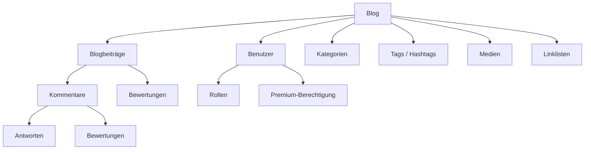
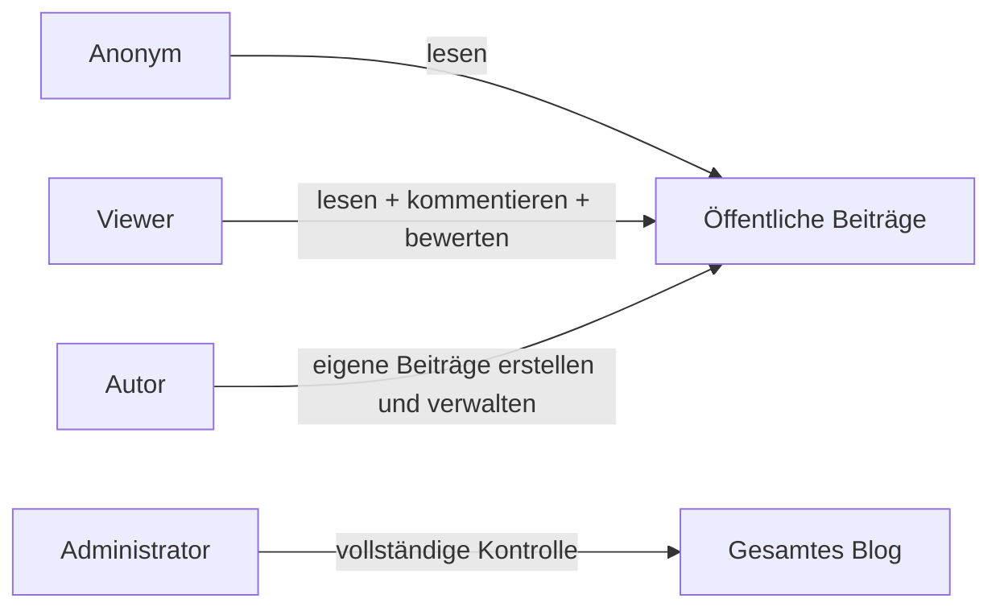
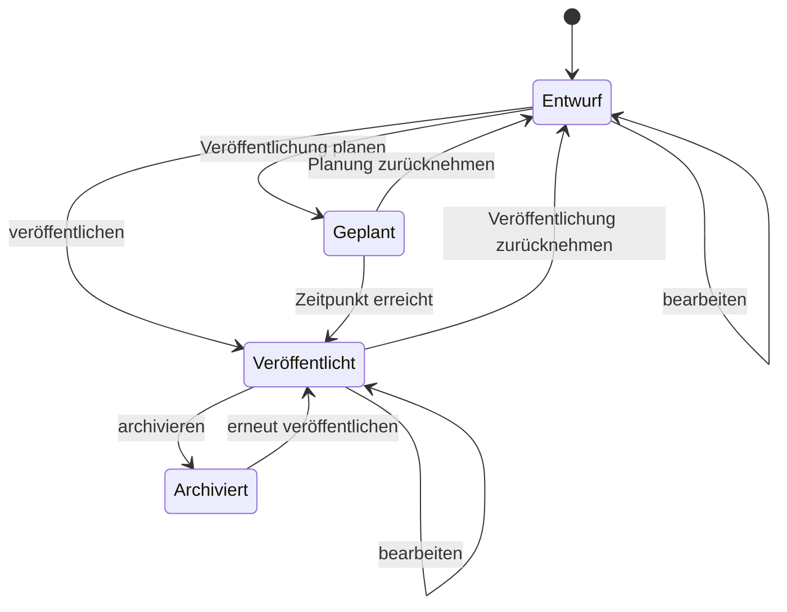
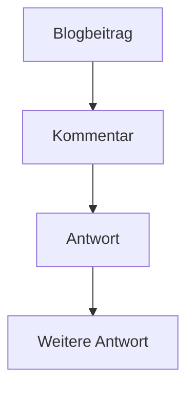
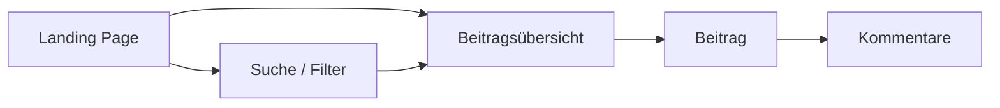
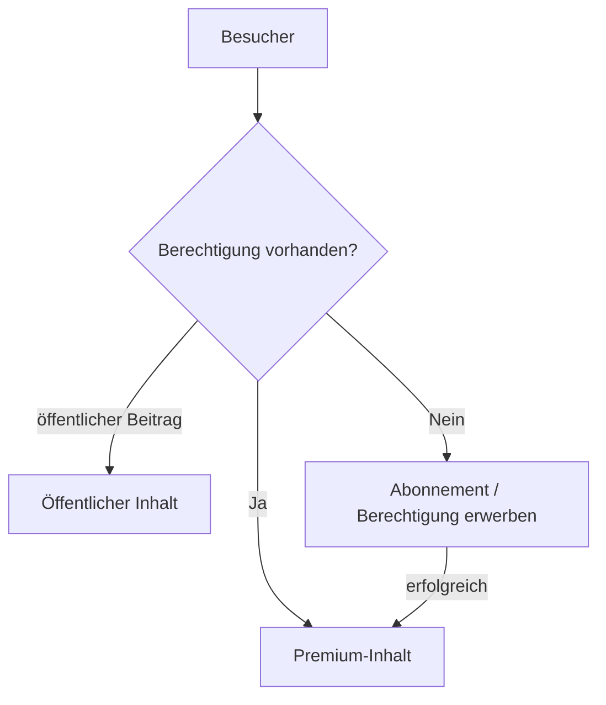

# FeatureFix1 – Generische Blog-Regelsammlung

**Version:** 1.0  
**Zweck:** Fachliche, technologieunabhängige Spezifikation eines generischen Blogs  
**Status:** Planungsgrundlage

---

## 1. Ziel und Abgrenzung

Diese Regelsammlung beschreibt die fachlichen Eigenschaften und das erwartete Verhalten eines generischen Blogs.

Sie ist bewusst **technologieunabhängig**. Die Spezifikation schreibt insbesondere keine Programmiersprache, kein Framework, keine Datenbank, kein Hosting und keinen konkreten externen Dienst vor.

Die konkrete visuelle Gestaltung und das Layout sind ebenfalls nicht Bestandteil dieser Spezifikation. Das Blog muss jedoch die erforderlichen Inhalte und Informationen bereitstellen, damit unterschiedliche ansprechende Darstellungen umgesetzt werden können.

Die Regeln sollen für unterschiedliche Einsatzszenarien geeignet sein, beispielsweise persönliche Blogs, Fachblogs, Unternehmensblogs, Magazine oder Blogs mit kostenpflichtigen Inhalten.

---

## 2. Grundmodell

Ein Blog besteht aus:

- Benutzern und Rollen
- Blogbeiträgen
- Kategorien
- Tags und Hashtags
- Medien
- Kommentaren und Antworten
- Bewertungen
- Linklisten
- öffentlichen und geschützten Inhalten

### 2.1 Grundzusammenhang

---

# 3. Benutzer und Rollen

## BR-010 – Benutzerverwaltung

Das Blog verfügt über eine Benutzerverwaltung.

Benutzer können angemeldet sein und abhängig von ihrer Rolle unterschiedliche Berechtigungen besitzen.

Mindestens folgende Rollen sind vorgesehen:

- **Viewer**
- **Autor**
- **Administrator**

Ein anonymer Besucher besitzt keine Benutzerrolle.

## BR-011 – Anonyme Besucher

Anonyme Besucher dürfen:

- veröffentlichte öffentliche Beiträge lesen
- öffentliche Beitragsübersichten ansehen
- nach Beiträgen suchen und diese filtern
- öffentliche Kommentare lesen
- Bilder und eingebundene Medien betrachten
- RSS-Inhalte abrufen

Anonyme Besucher dürfen nicht:

- Kommentare verfassen
- Bewertungen abgeben
- Beiträge erstellen oder bearbeiten
- geschützte Inhalte abrufen

## BR-012 – Viewer

Ein Viewer ist ein angemeldeter Benutzer mit Leserechten.

Viewer dürfen:

- öffentliche Beiträge lesen
- geschützte Inhalte lesen, sofern sie über die erforderliche Berechtigung verfügen
- Kommentare verfassen
- auf Kommentare antworten
- Beiträge und Kommentare bewerten

Viewer dürfen keine Blogbeiträge erstellen oder bearbeiten.

## BR-013 – Autor

Ein Autor darf:

- eigene Beiträge erstellen
- eigene Beiträge bearbeiten
- eigene Beiträge als Entwurf speichern
- eigene Beiträge veröffentlichen
- eigene Beiträge später weiter bearbeiten
- eigene Beiträge verwalten
- Beiträge für eine zukünftige Veröffentlichung planen
- Kommentare im Rahmen der für Autoren vorgesehenen Moderationsmöglichkeiten verwalten

Ein Autor darf grundsätzlich keine Beiträge anderer Autoren bearbeiten oder verwalten.

## BR-014 – Administrator

Der Administrator besitzt uneingeschränkte Rechte.

Der Administrator darf:

- alle Beiträge erstellen
- alle Beiträge bearbeiten
- alle Beiträge löschen
- alle Beiträge veröffentlichen
- Veröffentlichungen zurücknehmen
- Beiträge anderer Autoren verwalten
- alle Kommentare moderieren
- Kommentare löschen
- Kommentare beantworten
- Kommentare auszeichnen
- Benutzer verwalten
- Rollen verwalten
- Linklisten verwalten
- Systemeinstellungen verwalten
- sämtliche Inhalte und Ressourcen verwalten

**Grundregel:** Der Administrator unterliegt keinen Einschränkungen durch Besitzverhältnisse oder andere Rollen.

### 3.1 Rollenübersicht

---

# 4. Blogbeiträge

## BR-020 – Beitrag

Ein Blogbeitrag besitzt mindestens:

- Titel
- Titelbild
- Kurzbeschreibung / Einleitung
- Inhalt
- Autor
- Veröffentlichungsstatus
- Veröffentlichungsdatum
- Änderungsdatum
- eindeutige URL
- lesbaren Bezeichner für die URL

Zusätzlich kann ein Beitrag Kategorien, Tags und Hashtags besitzen.

## BR-021 – Titel

Jeder Beitrag muss einen Titel besitzen.

## BR-022 – Titelbild

Jeder Beitrag muss ein Titelbild besitzen.

Das Titelbild kann:

- aus einer vom Blog verwalteten Bildressource stammen oder
- über eine externe Bildquelle referenziert werden.

Das Titelbild kann in Übersichten, Vorschauen und der Einzelansicht verwendet werden.

## BR-023 – Kurzbeschreibung

Jeder Beitrag muss eine Kurzbeschreibung bzw. Einleitung besitzen.

Sie dient insbesondere der Darstellung in Übersichten, Suchergebnissen und Teasern.

Die Kurzbeschreibung ist unabhängig vom eigentlichen Beitragstext.

## BR-024 – Beitragstext

Der eigentliche Beitragstext wird in Markdown (MD) verfasst.

Der Inhalt kann formatierte Texte und eingebundene Medien enthalten.

## BR-025 – Kategorien

Ein Beitrag kann einer oder mehreren Kategorien zugeordnet werden.

Kategorien dienen der thematischen und strukturellen Einordnung von Beiträgen.

## BR-026 – Tags und Hashtags

Ein Beitrag kann mit Tags bzw. Schlagwörtern versehen werden.

Zusätzlich können Hashtags verwendet werden.

Tags und Hashtags können zur Suche, Filterung und thematischen Navigation verwendet werden.

Die konkrete technische Beziehung zwischen Tags und Hashtags ist nicht festgelegt.

---

# 5. Veröffentlichungsstatus

## BR-030 – Entwurf

Ein Beitrag kann als Entwurf gespeichert werden.

Ein Entwurf ist nicht öffentlich sichtbar.

Der Autor kann einen eigenen Entwurf jederzeit weiterbearbeiten.

Der Administrator kann alle Entwürfe verwalten.

## BR-031 – Veröffentlichung

Ein Autor darf entscheiden, ob ein eigener Beitrag:

- als Entwurf gespeichert oder
- veröffentlicht

wird.

Eine vorherige Freigabe durch den Administrator ist nicht erforderlich.

## BR-032 – Geplante Veröffentlichung

Ein Autor kann für einen Beitrag einen zukünftigen Veröffentlichungszeitpunkt festlegen.

Bis zu diesem Zeitpunkt bleibt der Beitrag unveröffentlicht.

Zum festgelegten Zeitpunkt wird der Beitrag automatisch veröffentlicht.

Der Administrator darf geplante Veröffentlichungen ändern oder verwalten.

## BR-033 – Bearbeitung veröffentlichter Beiträge

Ein Autor darf seine veröffentlichten Beiträge weiterhin bearbeiten.

Änderungen werden nach dem Speichern wirksam.

Der Administrator darf jederzeit Änderungen an jedem Beitrag vornehmen.

## BR-034 – Veröffentlichungsdatum

Ein veröffentlichter Beitrag besitzt ein Veröffentlichungsdatum.

Das Datum kann zur Sortierung und Darstellung verwendet werden.

## BR-035 – Änderungsdatum

Für jeden Beitrag wird das Datum der letzten Änderung geführt.

Das Änderungsdatum kann Besuchern angezeigt werden.

### 5.1 Beitragslebenszyklus

*Hinweis: „Archiviert“ ist als sinnvolle optionale Erweiterung vorgesehen; die konkrete Anwendung kann entscheiden, ob dieser Zustand benötigt wird.*

---

# 6. URL und Identifikation

## BR-040 – Eindeutige Identifikation

Jeder Beitrag besitzt einen eindeutigen Bezeichner.

## BR-041 – Lesbarer URL-Bezeichner

Jeder Beitrag besitzt einen lesbaren Bezeichner, der zur Bildung einer verständlichen URL verwendet werden kann.

Beispiel:

`/blog/linux-auf-alten-pcs`

## BR-042 – Eindeutige URL

Jeder veröffentlichte Beitrag besitzt eine eindeutige URL.

Eine bereits veröffentlichte URL soll nicht durch eine einfache Änderung des Beitragstitels unbeabsichtigt ungültig werden.

Die konkrete technische Umsetzung dauerhafter URLs ist nicht Bestandteil dieser Spezifikation.

---

# 7. Medien

## BR-050 – Bilder

Beiträge können Bilder enthalten.

Bilder können entweder:

1. hochgeladen und vom Blog verwaltet werden oder
2. über eine externe URL eingebunden werden.

## BR-051 – Eigene Medien

Hochgeladene Bilder werden vom Blog verwaltet und stehen für die Verwendung in Beiträgen zur Verfügung.

Die genaue Form der Speicherung ist nicht Bestandteil dieser Spezifikation.

## BR-052 – Externe Bilder

Externe Bilder können über eine URL eingebunden werden.

Das Blog übernimmt keine Verantwortung für die dauerhafte Verfügbarkeit der externen Ressource.

## BR-053 – Externe Videos

Beiträge können Videos externer Plattformen einbinden.

Die konkrete Plattform ist nicht vorgeschrieben.

Die externe Plattform kann beispielsweise für Hosting und Streaming des Videos verantwortlich sein.

## BR-054 – Eigene Videos

Das Blog soll grundsätzlich die Möglichkeit vorsehen, eigene Videoinhalte einzubinden.

Das Video muss dabei nicht zwingend durch das Blog selbst gespeichert oder ausgeliefert werden.

Es kann auch über einen externen Video- oder Streamingdienst bereitgestellt werden.

## BR-055 – Externe Medienanbieter

Die Spezifikation darf nicht von einem bestimmten Medienanbieter abhängig sein.

Geeignete externe Dienste können später beispielsweise für:

- Videohosting
- Streaming
- CDN
- Zugriffsschutz
- Medienverwaltung

integriert werden.

Die konkrete Auswahl eines Anbieters ist nicht Bestandteil dieser Spezifikation.

---

# 8. Kommentare und Diskussionen

## BR-060 – Kommentare

Angemeldete Benutzer können Blogbeiträge kommentieren.

Anonyme Besucher können keine Kommentare verfassen.

## BR-061 – Antworten

Ein Kommentar kann beantwortet werden.

Antworten sind wiederum Kommentare und können daher selbst:

- beantwortet
- bewertet
- moderiert

werden.

Die maximale Verschachtelungstiefe wird nicht durch die generische Spezifikation festgelegt und kann durch die jeweilige Anwendung bestimmt werden.

## BR-062 – Kommentarstruktur

Ein Kommentar kann entweder:

- direkt einem Blogbeitrag oder
- einem anderen Kommentar

zugeordnet sein.

## BR-063 – Kommentarverwaltung

Der Administrator kann sämtliche Kommentare verwalten und moderieren.

Dazu gehören insbesondere:

- löschen
- beantworten
- auszeichnen
- moderieren

Autoren können Kommentare im Rahmen der für ihre Beiträge vorgesehenen Moderationsrechte verwalten.

---

# 9. Bewertungen

## BR-070 – Bewertung von Beiträgen

Angemeldete Benutzer können Blogbeiträge bewerten.

Es stehen zur Verfügung:

- 👍 Daumen hoch
- 👎 Daumen runter

Ein Benutzer kann einen Beitrag höchstens einmal gleichzeitig bewerten.

Eine abgegebene Bewertung kann geändert werden.

Anonyme Besucher dürfen keine Bewertungen abgeben.

## BR-071 – Bewertung von Kommentaren

Angemeldete Benutzer können Kommentare bewerten.

Es stehen ebenfalls zur Verfügung:

- 👍 Daumen hoch
- 👎 Daumen runter

Ein Benutzer kann einen Kommentar höchstens einmal gleichzeitig bewerten.

Eine Bewertung kann geändert werden.

## BR-072 – Bewertung von Antworten

Antworten auf Kommentare sind ebenfalls Kommentare.

Sie können daher ebenfalls mit 👍 oder 👎 bewertet werden.

---

# 10. Öffentliche Blogdarstellung

## BR-080 – Landing Page

Das Blog besitzt eine öffentliche Landing Page.

Dort werden veröffentlichte Beiträge übersichtlich dargestellt.

Ein Beitrag wird mindestens durch:

- Titelbild
- Titel

repräsentiert.

Die Darstellung muss das direkte Öffnen des Beitrags ermöglichen.

Die konkrete Gestaltung ist nicht Bestandteil dieser Spezifikation.

## BR-081 – Beitragsvorschau

Für Beiträge können insbesondere folgende Informationen in Übersichten verwendet werden:

- Titel
- Titelbild
- Kurzbeschreibung
- Autor
- Veröffentlichungsdatum
- Änderungsdatum
- Kategorien
- Tags
- Hashtags
- Premium-Kennzeichnung

## BR-082 – Such- und Übersichtsseite

Das Blog stellt eine Such- und Übersichtsseite für Beiträge bereit.

Beiträge können gesucht, gefiltert und sortiert werden.

Mögliche Kriterien sind insbesondere:

- Suchbegriff
- Titel
- Kategorie
- Tag
- Hashtag
- Autor
- Veröffentlichungsdatum
- Änderungsdatum
- Bewertung
- Zugriffsstufe

Die konkrete Kombination und Darstellung der Filter ist Sache der jeweiligen Anwendung.

### 10.1 Öffentliche Navigation

---

# 11. Linklisten

## BR-090 – Benutzerdefinierte Linklisten

Der Administrator kann eigene Linklisten für Blogbeiträge erstellen und verwalten.

Der Administrator bestimmt, welche Beiträge Bestandteil einer Linkliste sind.

## BR-091 – Reihenfolge

Die Reihenfolge der Beiträge innerhalb einer Linkliste kann durch den Administrator festgelegt werden.

Damit können redaktionell zusammengestellte Listen unabhängig vom Veröffentlichungsdatum erstellt werden.

## BR-092 – Einbindung

Eine Linkliste kann in eine andere Webseite oder in eine andere Seite desselben Webauftritts eingebunden werden.

Die eingebundene Darstellung enthält anklickbare Verweise auf die ausgewählten Beiträge.

Die konkrete technische Einbindungsform ist nicht Bestandteil dieser Spezifikation.

---

# 12. RSS

## BR-100 – RSS-Feed

Das Blog stellt einen RSS-Feed für veröffentlichte Beiträge bereit.

Neue Veröffentlichungen werden im Feed berücksichtigt.

Der Feed enthält die für die Darstellung eines Beitrags in einem RSS-Reader erforderlichen Informationen.

Die konkrete technische Umsetzung des Feeds ist nicht Bestandteil dieser Spezifikation.

---

# 13. Premium- und geschützte Inhalte

Das Blog soll grundsätzlich die Möglichkeit unterstützen, Inhalte mit unterschiedlichen Zugriffsstufen zu versehen.

## BR-110 – Zugriffsstufen

Ein Beitrag kann mindestens einer der folgenden Zugriffsstufen zugeordnet werden:

- öffentlich
- angemeldete Benutzer
- Premium / zahlende Benutzer

Die konkrete Anzahl weiterer Zugriffsstufen kann durch die jeweilige Anwendung erweitert werden.

## BR-111 – Öffentliche Darstellung von Premium-Beiträgen

Premium-Beiträge dürfen in öffentlichen:

- Beitragsübersichten
- Suchergebnissen
- Kategorien
- Linklisten

erscheinen.

Nicht berechtigte Besucher sehen dabei insbesondere:

- Titel
- Titelbild
- Kurzbeschreibung / Teaser
- Veröffentlichungsdatum
- gegebenenfalls Autor
- Kennzeichnung als Premium-Inhalt

Der geschützte eigentliche Inhalt wird nicht vollständig angezeigt.

## BR-112 – Zugriff auf Premium-Inhalte

Ein nicht berechtigter Besucher, der einen Premium-Beitrag aufruft, erhält eine Möglichkeit, die erforderliche Zugriffsberechtigung zu erwerben.

Dies kann beispielsweise über ein Abonnement erfolgen.

## BR-113 – Premium-Berechtigung

Der Zugriff auf Premium-Inhalte basiert auf einer Berechtigung des angemeldeten Benutzers.

Das Blog unterscheidet mindestens zwischen:

- anonymem Besucher
- angemeldetem Benutzer ohne Premium-Berechtigung
- angemeldetem Benutzer mit Premium-Berechtigung
- Administrator

Ein Benutzerkonto allein berechtigt nicht automatisch zum Zugriff auf Premium-Inhalte.

## BR-114 – Externe Monetarisierung

Die Zahlungs-, Abonnement- und Mitgliederverwaltung kann durch einen externen Dienst erfolgen.

Das Blog soll nicht an einen bestimmten Anbieter gebunden sein.

Mögliche externe Dienste können beispielsweise Funktionen für:

- Abonnements
- Mitgliedschaften
- Zahlungsabwicklung
- Videohosting
- Streaming
- Zugriffsschutz

bereitstellen.

Die konkrete Auswahl und Integration eines solchen Dienstes ist nicht Bestandteil dieser generischen Spezifikation.

### 13.1 Premium-Zugriff

---

# 14. Grundsätze für externe Integrationen

## BR-120 – Anbieterunabhängigkeit

Die generische Blog-Spezifikation schreibt keinen bestimmten externen Anbieter vor.

Externe Anbieter können für einzelne Funktionen integriert werden, ohne das fachliche Grundmodell des Blogs zu verändern.

Mögliche Integrationsbereiche sind:

- Videohosting
- Streaming
- Zahlungsabwicklung
- Abonnements
- Mitgliederverwaltung
- Newsletter
- externe Medien
- CDN
- Social Media

## BR-121 – Trennung von Blog und externen Diensten

Das Blog soll fachlich zwischen eigenen Inhalten und extern bereitgestellten Diensten unterscheiden.

Der Ausfall eines externen Dienstes soll nicht dazu führen, dass nicht betroffene Blogfunktionen grundsätzlich unbrauchbar werden.

---

# 15. Fachliche Kernregeln in Kurzform

Das Blog folgt insbesondere diesen Grundsätzen:

1. **Jeder Beitrag besitzt Titel, Titelbild, Kurzbeschreibung und Markdown-Inhalt.**
2. **Beiträge können Kategorien, Tags und Hashtags besitzen.**
3. **Beiträge besitzen Veröffentlichungs- und Änderungsinformationen.**
4. **Beiträge besitzen eine eindeutige und lesbare URL.**
5. **Autoren verwalten ihre eigenen Beiträge.**
6. **Autoren entscheiden selbst über Veröffentlichung oder spätere Veröffentlichung.**
7. **Der Administrator darf alles verwalten.**
8. **Anonyme Besucher dürfen lesen, aber nicht kommentieren oder bewerten.**
9. **Viewer sind angemeldete Benutzer und dürfen kommentieren und bewerten.**
10. **Kommentare können beliebig gemäß der durch die Anwendung festgelegten maximalen Verschachtelungstiefe beantwortet werden.**
11. **Beiträge und Kommentare können mit 👍/👎 bewertet werden.**
12. **Bilder können hochgeladen oder extern eingebunden werden.**
13. **Videos können von externen Plattformen eingebunden werden.**
14. **Das Blog soll auch eigene bzw. extern gehostete Videos unterstützen können.**
15. **Das Blog besitzt eine öffentliche Landing Page.**
16. **Beiträge können gesucht, gefiltert und sortiert werden.**
17. **Der Administrator kann redaktionelle Linklisten zusammenstellen.**
18. **Linklisten können in andere Webseiten eingebunden werden.**
19. **Das Blog stellt einen RSS-Feed bereit.**
20. **Beiträge können öffentlich, nur für angemeldete Benutzer oder als Premium-Inhalt zugänglich sein.**
21. **Premium-Beiträge dürfen öffentlich als Teaser erscheinen.**
22. **Nicht berechtigte Besucher erhalten eine Möglichkeit, die erforderliche Premium-Berechtigung zu erwerben.**
23. **Monetarisierung und externe Dienste bleiben vom eigentlichen Blog fachlich entkoppelt.**

---

# 16. Bewusst nicht festgelegt

Die folgenden Punkte sind ausdrücklich offen und sollen nicht durch diese Spezifikation vorweggenommen werden:

- Programmiersprache
- Framework
- Datenbank
- Hostinganbieter
- Cloudanbieter
- konkrete Videoplattform
- konkreter Zahlungsanbieter
- konkreter Abonnementdienst
- konkreter Newsletterdienst
- konkrete Authentifizierungstechnik
- konkretes Layout
- Farben und Design
- konkrete Markdown-Implementierung
- konkrete Einbettungstechnik für Linklisten
- maximale Kommentarverschachtelung
- technische Speicherung von Medien
- technische Umsetzung von RSS
- technische Umsetzung von URLs

Diese Entscheidungen gehören in die spätere technische Umsetzung und nicht in die generische fachliche Blog-Spezifikation.

---

# 17. Ziel der Spezifikation

FeatureFix1 beschreibt **was das Blog fachlich leisten soll**, nicht **wie es technisch umgesetzt werden muss**.

Eine spätere technische Implementierung muss diese Regeln erfüllen, darf sie aber mit unterschiedlichen Technologien und externen Diensten realisieren.

Die Spezifikation soll deshalb als Grundlage für die weitere Planung und als fachlicher Referenzrahmen für einen AI-Coding-Agenten dienen.
