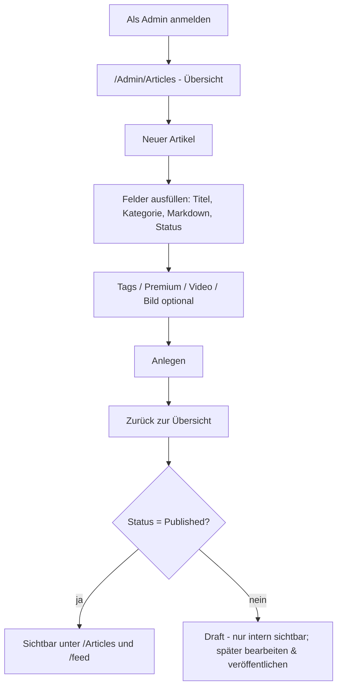

# Admin-Bereich: Artikelverwaltung

Diese Seite beschreibt, wie man den Admin-Bereich verwendet, um Artikel zu
erstellen, zu bearbeiten, zu veröffentlichen und zu löschen.

**Voraussetzung:** Das eigene Konto besitzt die Identity-Rolle `Admin` oder
`Author` (siehe [`01-rollen-und-admin.md`](01-rollen-und-admin.md)). Ist man
eingeloggt, erscheint in der Navigation der Eintrag **„Verwaltung"**, der direkt
zur Artikelverwaltung führt.

- **`Admin`** sieht und bearbeitet **alle** Artikel.
- **`Author`** sieht und bearbeitet **ausschließlich eigene** Artikel; fremde
  Beiträge werden serverseitig verweigert.

## Erreichbare Seiten

| Seite | URL | Zweck |
|---|---|---|
| Übersicht | `/Admin/Articles` | Artikel (inkl. Entwürfe; für `Author` nur eigene) in einer Tabelle |
| Neu | `/Admin/Articles/Create` | Neuen Artikel anlegen |
| Bearbeiten | `/Admin/Articles/Edit?id={guid}` | Bestehenden Artikel bearbeiten |
| Linklisten | `/Admin/LinkLists` | Redaktionelle Linklisten verwalten (nur `Admin`) |

Alle Seiten sind mit der Policy `RequireAuthor` (bzw. `RequireAdmin` für
Linklisten) geschützt — ohne passende Rolle wird der Zugriff serverseitig
verweigert.

## Übersicht (`/Admin/Articles`)

Die Tabelle listet alle Artikel (sortiert nach zuletzt geändert) mit folgenden
Spalten:

| Spalte | Bedeutung |
|---|---|
| Titel | Artikeltitel |
| Kategorie | Politik / Satire / Verschwörungstheorien (als farbiger Badge) |
| Status | `Draft`, `Published` oder `Archived` |
| Premium | `Ja`/`Nein` — ob der Artikel hinter der Paywall liegt |
| Veröffentlicht | Zeitpunkt der ersten Veröffentlichung (oder `–`) |
| Aktionen | **Bearbeiten** und **Löschen** |

Oben rechts führt **„Neuer Artikel"** zum Anlegeformular.

## Artikel anlegen (`/Admin/Articles/Create`)

Das Formular wird von derselben Feld-Partial wie die Bearbeitung gerendert.
Folgende Felder stehen zur Verfügung:

| Feld | Pflicht | Hinweise |
|---|---|---|
| **Titel** | ja | max. 300 Zeichen |
| **Slug** | nein | URL-Segment; wird sonst automatisch aus dem Titel erzeugt und bei Kollision mit `-2`, `-3` … eindeutig gemacht. Bereits veröffentlichte URLs bleiben bei Titeländerung stabil. |
| **Titelbild-URL** | ja* | externe Bild-URL; Alternative/Fallback ist der Bild-Upload (*genau eine der beiden Quellen ist Pflicht) |
| **Kurzbeschreibung / Excerpt** | ja | max. 500 Zeichen; dient als Vorschau (Artikelliste, Paywall-Teaser, RSS-Beschreibung) |
| **Kategorie** | ja | `Politik`, `Satire`, `Verschwoerungstheorien` |
| **Zugriffsstufe** | ja | `Public`, `Registered` (nur angemeldet), `Premium` (aktive Berechtigung) |
| **Status** | ja | `Draft` (Standard), `Scheduled`, `Published`, `Archived` |
| **Geplante Veröffentlichung** | nein | Zeitpunkt (`ScheduledAt`); erforderlich bei `Status = Scheduled` — der Beitrag wird dann automatisch veröffentlicht |
| **Tags** | nein | kommagetrennt (auch `;` oder Zeilenumbruch); neue Tags werden automatisch angelegt |
| **Hashtags** | nein | kommagetrennt, mit oder ohne führendes `#`; eigene Struktur für Filter/Navigation |
| **Inhalt (Markdown)** | ja | wird serverseitig gerendert und sanitized |
| **Video-URL** | nein | YouTube, Vimeo, X, TikTok — wird per oEmbed aufgelöst |
| **Bild hochladen** | nein | JPEG, PNG, WebP oder GIF; dient als Titelbild, wenn keine externe URL gesetzt ist |

Nach dem Absenden wird der Artikel angelegt und man landet zurück in der
Übersicht (Erfolgsmeldung via `TempData`).

### Details zu ausgewählten Feldern

- **Slug:** Wird der Slug leer gelassen, wird er aus dem Titel abgeleitet. Für
  Eindeutigkeit sorgt der `ArticleService`; existiert der Slug bereits, wird ein
  numerisches Suffix angehängt (`mein-artikel-2`).
- **Inhalt (Markdown):** Der Markdown-Text wird **nicht** roh ausgeliefert,
  sondern über Markdig gerendert und mit HtmlSanitizer bereinigt;
  `javascript:`-URLs werden entfernt (XSS-Schutz).
- **Video-URL:** Es wird ausschließlich der offizielle oEmbed-Code verwendet,
  eingebettet in ein `<iframe sandbox="allow-scripts allow-popups">` ohne
  `allow-same-origin`. Nicht unterstützte Plattformen werden nur verlinkt.
- **Bild:** Die Datei wird anhand des echten Inhalts validiert, skaliert,
  optional nach WebP konvertiert und **ohne EXIF** gespeichert. Im Dev-Modus
  liegt sie unter `wwwroot/uploads` (Provider `Local`).

## Artikeltags & Kategorien

- **Kategorien** sind fest definiert und dienen auch der inhaltlichen
  Kennzeichnung: `Politik`, `Satire`, `Verschwoerungstheorien`.
  Für `Satire` und `Verschwoerungstheorien` wird automatisch ein
  Hinweistext (Disclaimer) angezeigt.
- **Tags** sind frei und werden bei Bedarf neu erzeugt. Sie dienen als
  Filter auf der öffentlichen Artikelliste (`/Articles?tag={slug}`).

## Veröffentlichen (Publish-Workflow)

- Nur Artikel mit `Status = Published` **und** gesetztem `PublishedAt` sind
  öffentlich sichtbar.
- `PublishedAt` wird **einmalig** beim ersten Wechsel auf `Published` gesetzt
  und danach nicht mehr überschrieben.
- Ein Entwurf (`Draft`) ist also erst nach Umschalten auf `Published` im Blog
  sichtbar.
- **`Scheduled`** (geplante Veröffentlichung): Der Beitrag erhält einen
  `ScheduledAt`-Zeitpunkt und bleibt bis dahin unveröffentlicht. Ein
  Hintergrunddienst veröffentlicht ihn automatisch zum Zeitpunkt
  (`Status` → `Published`, `PublishedAt = ScheduledAt`).
- `Archived` nimmt einen Artikel aus der öffentlichen Liste, ohne ihn zu löschen.

Kurz: Anlegen/bearbeiten mit `Status = Published` → erscheint unter `/Articles`
und im RSS-Feed `/feed`.

## Linklisten (`/Admin/LinkLists`)

Nur für `Admin`. Hier werden redaktionelle, **geordnete** Listen von Beiträgen
angelegt und verwaltet:

- Zuordnung von Beiträgen zu einer Liste, inklusive Reihenfolge (unabhängig vom
  Veröffentlichungsdatum).
- Öffentliche Darstellung unter `/LinkLists/{slug}`; die Liste ist anklickbar und
  in andere Seiten einbettbar.

## Artikel bearbeiten (`/Admin/Articles/Edit?id=…`)

- Das Formular ist mit den aktuellen Werten vorbefüllt (inkl. Tags als
  kommagetrennte Liste und vorhandener Video-URL).
- Beim Speichern werden Slug, Inhalt, Teaser, Kategorie, Premium, Status und
  Tags aktualisiert.
- Wird eine Video-URL gesetzt, ersetzt sie vorhandene Video-Einbettungen des
  Artikels.
- Wird ein Bild hochgeladen, wird es als weiteres Medien-Asset ergänzt.

## Artikel löschen

- Über die Schaltfläche **Löschen** in der Übersicht (mit Sicherheitsabfrage).
- Das Löschen ist ein **Soft-Delete**: Der Artikel erhält einen `DeletedAt`-Zeitstempel
  und erscheint nicht mehr in der Verwaltung/öffentlich, bleibt aber in der
  Datenbank erhalten (Datenintegrität / Historie).

## Praktischer Ablauf (Kurzfassung)

## Weiterführend

- Rollen & Admin-Zugang: [`01-rollen-und-admin.md`](01-rollen-und-admin.md)
- Blog aus Nutzersicht: [`03-blog-nutzen.md`](03-blog-nutzen.md)
