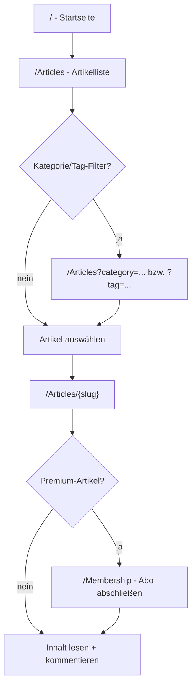

# Blog nutzen (rudimentär)

Kurze Übersicht über die Nutzung des Blogs aus **Leser- und Autorensicht**.
Für das Schreiben/Verwalten von Artikeln siehe
[`02-admin-artikelverwaltung.md`](02-admin-artikelverwaltung.md).

## Grundprinzip

- Artikel werden in **Markdown** verfasst und beim Ausliefern serverseitig
  gerendert und bereinigt (Markdig + HtmlSanitizer).
- Jeder Artikel hat eine **Kategorie** (Politik, Satire,
  Verschwörungstheorien), optionale **Tags** und einen **Slug** für die URL.
- Nur `Published`-Artikel sind öffentlich sichtbar.
- Premium-Artikel sind erst mit aktivem Abo (oder als Admin) lesbar.

## Artikel lesen

| Ziel | URL |
|---|---|
| Startseite | `/` |
| Artikelliste | `/Articles` |
| Einzelner Artikel | `/Articles/{slug}` |
| RSS-Feed (RSS 2.0) | `/feed` |

### Artikelliste (`/Articles`)

- Zeigt die veröffentlichten Artikel, **10 pro Seite**, sortiert nach
  Veröffentlichungsdatum (neueste zuerst).
- Filter nach **Kategorie**: `/Articles?category=Satire`
- Filter nach **Tag**: `/Articles?tag={tag-slug}`
- Seitenwechsel über `?pageNumber=2` usw.

### Artikel-Detailseite (`/Articles/{slug}`)

- Zeigt Titel, Autor, Kategorie-Badge, Inhalt und – falls vorhanden – Bilder
  und Video-Einbettungen.
- Für `Satire` und `Verschwörungstheorien` erscheint ein Hinweistext
  (Disclaimer).
- Unter dem Artikel befindet sich der **Kommentarbereich** (siehe unten).

### RSS-Feed (`/feed`)

- RSS 2.0 über die letzten bis zu **50** veröffentlichten Artikel.
- Einträge enthalten Titel, Link, Kategorie, Datum und den Teaser/Excerpt.
- Als `<link>`/GUID wird `/Articles/{slug}` verwendet.

## Kommentare

Kommentieren erfordert ein **angemeldetes Konto mit bestätigter E-Mail-Adresse**.

- **Hinzufügen:** Auf der Artikeldetailseite (optional mit Bild-Upload).
- **Bearbeiten:** Eigene Kommentare innerhalb des konfigurierten Bearbeitungs-
  fensters (`EditWindowMinutes`).
- **Löschen:** Eigene Kommentare; Moderatoren/Admins können jeden Kommentar
  löschen (Soft-Delete).
- **Melden:** Kommentare können mit Grund und optionaler Notiz gemeldet werden.

Moderation (Rollen `Moderator`/`Admin`) erfolgt unter `/Moderation`:
offene Meldungen sowie ausstehende/geflaggte Kommentare können dort
**genehmigt**, **abgelehnt** oder Meldungen **verworfen** werden.

> Konfiguration der Kommentare (Modus, Rate-Limit, Bearbeitungsfenster) erfolgt
> über die `Comments`-Sektion in `appsettings.json`.

## Account & Anmeldung

| Aufgabe | URL |
|---|---|
| Registrieren | `/Account/Register` |
| Anmelden / Abmelden | `/Account/Login`, `/Account/Logout` |
| Eigener Account | `/Account/Manage` |
| E-Mail bestätigen | Link aus der Dev-E-Mail unter `bin/…/App_Data/emails/` |

Neue Konten erhalten die Rolle `Reader` und müssen die E-Mail bestätigen,
bevor sie kommentieren oder ein Abo abschließen können.

## Mitgliedschaft & Premium

| Aufgabe | URL |
|---|---|
| Mitgliedschaft / Übersicht | `/Membership` |
| Checkout | `/Membership/Checkout` |
| Spenden | `/Donate` |

Premium-Artikel (`IsPremium = true`) sind nur mit aktivem Abo lesbar; im
Dev-Modus simuliert `FakeStripeService` den Checkout (kein echter Stripe-Key
nötig). Die Zugriffsprüfung basiert auf dem **Abo-Status**, nicht allein auf der
Rolle. Admins haben immer Zugriff.

## Newsletter

| Aufgabe | URL |
|---|---|
| Abonnieren | `/Newsletter/Subscribe` |
| Bestätigen (Double-Opt-in) | Link aus der Bestätigungs-E-Mail |
| Abmelden | `/Newsletter/Unsubscribe` |

Der Newsletter nutzt **Double-Opt-in**; nicht bestätigte Anmeldungen werden nach
`UnconfirmedRetentionDays` Tagen automatisch entfernt.

## Typischer Leser-Flow

## Weiterführend

- Rollen & Admin-Zugang: [`01-rollen-und-admin.md`](01-rollen-und-admin.md)
- Artikel schreiben/verwalten: [`02-admin-artikelverwaltung.md`](02-admin-artikelverwaltung.md)
- Details zu Features: Module 01–05 im Projekt-Root
