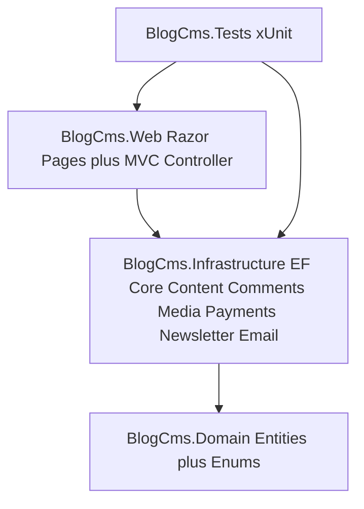
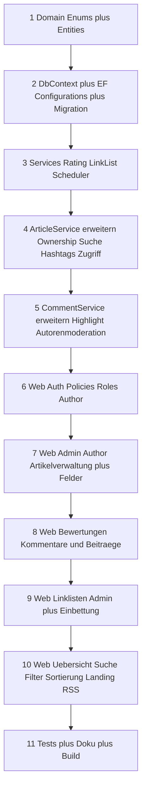

# feature_implementation1 — Abgleich FeatureFix1 (Soll) gegen Ist-Zustand

> **Umsetzungsstatus: ABGESCHLOSSEN.**
> Alle Arbeitspakete P1–P15 wurden implementiert. Ergebnis: `dotnet build` fehlerfrei
> (0 Warnungen), `dotnet test` mit **38/38** bestandenen Tests, EF-Migration
> `20260913162054_FeatureFix1_NewFeatures` erfolgreich gegen PostgreSQL angewendet,
> Laufzeit-Smoke-Test der Kernseiten erfolgreich (siehe Abschnitt 12).

**Bezug:** [`FeatureFix1.MD`](FeatureFix1.MD) (generische, technologieunabhängige Blog-Regelsammlung)
**Projekt:** MentalVersagen / BlogCms (.NET 10, ASP.NET Core Razor Pages, EF Core, PostgreSQL)
**Stand:** v1.1 — Analyse + Umsetzung
**Zweck:** Dieses Dokument protokolliert den **Soll-Ist-Abgleich** zwischen den finalen
Anforderungen aus `FeatureFix1.MD` und dem Projektzustand, leitet die priorisierte
Umsetzungsreihenfolge ab und dokumentiert den erreichten Umsetzungsstand.

---

## 1. Vorgehen

1. Anforderungen aus `FeatureFix1.MD` in ihre Regel-IDs (BR-xxx) zerlegen.
2. Den Ist-Zustand aus Code (`src/`) und Datenmodell (`DataSchema.md`) je Regel bewerten.
3. Jede Regel einer von drei Kategorien zuordnen:
   - **✔ vorhanden** — Anforderung ist bereits fachlich erfüllt.
   - **◑ teilweise** — Grundlage vorhanden, aber Lücke zu FeatureFix1.
   - **✘ fehlt** — noch nicht implementiert.
4. Für jede Lücke eine konkrete Maßnahme (Datenmodell → Service → UI → Test) festlegen.
5. Eine **optimale Implementierungsreihenfolge** ableiten (Abhängigkeiten zuerst:
   Domain/Enums → Persistenz/Migration → Services → Web-UI → Tests).

---

## 2. Ist-Zustand (Architektur-Überblick)

- **Domain:** `User`, `Article`, `Tag`, `ArticleTag`, `Comment`, `MediaAsset`, `VideoEmbed`,
  `Subscription`, `Donation`, `NewsletterSubscriber`, `Report`.
- **Enums:** `UserRole` (Reader, Premium, Moderator, Admin), `ArticleStatus` (Draft, Published,
  Archived), `ArticleCategory` (Politik, Satire, Verschwoerungstheorien), `CommentStatus`,
  `MediaOwnerType`, `VideoPlatform`, `SubscriptionStatus`, `UserSubscriptionStatus`,
  `DonationStatus`, `PaymentProvider`, `ReportReason`, `ReportStatus`.
- **Services:** `ArticleService`, `CommentService`, `MediaService`, `OEmbedService`,
  `SubscriptionService`, `NewsletterService`.
- **Web:** öffentliche Seiten (`Index`, `Articles/Index`, `Articles/Details`), Admin-Bereich
  (`Admin/Articles`), Moderation, Membership, Donate, Newsletter, Account; RSS-`FeedController`
  und `StripeWebhookController`.
- **Bereits umgesetzt:** Markdown-Rendering mit Sanitizing, Slug-Eindeutigkeit,
  Bild-Upload/Verarbeitung/EXIF-Strip, oEmbed-Video-Embedding (sandboxed iframe), Kommentare
  mit Threading/Moderation/Meldungen/Rate-Limit, Paywall über Abo-Status, Stripe/Spenden,
  Newsletter Double-Opt-in, RSS 2.0, Soft-Delete.

---

## 3. Soll-Ist-Abgleich je Regel

Legende: **✔** erfüllt · **◑** teilweise · **✘** fehlt

### 3.1 Benutzer und Rollen (§3)

| Regel | Anforderung (Soll) | Ist (vorher) | Lücke / Maßnahme |
|---|---|---|---|
| BR-010 | Benutzerverwaltung + Rollen Viewer/Autor/Administrator | ◑ | Vorhanden: Reader/Premium/Moderator/Admin. **Neue Rolle `Author`** ergänzt; Viewer ≙ `Reader`, Administrator ≙ `Admin`. |
| BR-011 | Anonyme Besucher dürfen lesen, suchen, filtern, RSS, Medien; **nicht** kommentieren/bewerten | ◑ | Lesen/Suche/Filter/RSS vorhanden. **Bewertungen ergänzt**; UI verhindert anonyme Bewertung. |
| BR-012 | Viewer: lesen, geschützte Inhalte (mit Berechtigung), kommentieren, antworten, bewerten | ◑ | Lesen/Kommentieren/Antworten/Bewerten ergänzt; Zugriffsstufe „nur angemeldet" ergänzt. |
| BR-013 | Autor: eigene Beiträge erstellen/bearbeiten/Entwurf/veröffentlichen/planen/verwalten, keine fremden | ✘ | Neue Rolle `Author` + Besitzprüfung + `RequireAuthor`-Policy ergänzt. |
| BR-014 | Administrator: uneingeschränkt (Beiträge, Kommentare moderieren/auszeichnen, Linklisten, Nutzer/Rollen) | ◑ | Kommentar-Auszeichnung + Linklisten-Verwaltung ergänzt; Nutzer-/Rollenverwaltungs-UI bleibt (dokumentiert) per SQL. |

### 3.2 Blogbeiträge (§4)

| Regel | Anforderung (Soll) | Ist (vorher) | Lücke / Maßnahme |
|---|---|---|---|
| BR-020 | Beitrag: Titel, **Titelbild**, Kurzbeschreibung, Inhalt, Autor, Status, Veröffentlichungs-/Änderungsdatum, eindeutige URL + lesbarer Bezeichner | ◑ | **Titelbild** (`TitleImageUrl` + Upload-Fallback) ergänzt; `Excerpt` als Pflicht validiert. |
| BR-021 | Pflichtfeld Titel | ✔ | `Title` required. |
| BR-022 | Pflicht: Titelbild — verwaltete Ressource **oder** externe URL | ✘ | `TitleImageUrl` + Fallback auf Upload-Asset; Pflicht in Formular/Service. |
| BR-023 | Pflicht: Kurzbeschreibung/Excerpt unabhängig vom Text | ◑ | `Excerpt` als Pflichtfeld validiert. |
| BR-024 | Beitragstext in Markdown | ✔ | `ContentMarkdown` + sanitized Rendering. |
| BR-025 | 1..n Kategorien | ◑ | Bewusst genau eine Kategorie (Enum) — dokumentierte Abweichung. |
| BR-026 | Tags **und** Hashtags | ◑ | `Hashtag`/`ArticleHashtag` ergänzt, Sync + Filter. |

### 3.3 Veröffentlichungsstatus (§5)

| Regel | Anforderung (Soll) | Ist (vorher) | Lücke / Maßnahme |
|---|---|---|---|
| BR-030 | Entwurf nicht öffentlich, weiterbearbeitbar | ✔ | `Draft` + Soft-Delete/Filter. |
| BR-031 | Autor entscheidet über Veröffentlichung, keine Admin-Freigabe | ◑ | Autor-Veröffentlichung via `RequireAuthor` + Ownership. |
| BR-032 | **Geplante Veröffentlichung** + automatische Veröffentlichung | ✘ | `ArticleStatus.Scheduled` + `ScheduledAt` + `ArticleSchedulerService` ergänzt. |
| BR-033 | Veröffentlichte Beiträge bleiben bearbeitbar | ✔ | `UpdateAsync` erlaubt Bearbeitung. |
| BR-034 | Veröffentlichungsdatum | ✔ | `PublishedAt`. |
| BR-035 | Änderungsdatum | ✔ | `UpdatedAt`. |

### 3.4 URL und Identifikation (§6)

| Regel | Anforderung (Soll) | Ist (vorher) | Lücke / Maßnahme |
|---|---|---|---|
| BR-040 | Eindeutiger Bezeichner | ✔ | `Id` (Guid) + `Slug`. |
| BR-041 | Lesbarer URL-Bezeichner | ✔ | `SlugGenerator` + `/Articles/{slug}`. |
| BR-042 | Eindeutige, stabile URL (Titeländerung darf URL nicht brechen) | ◑ | URLs bleiben stabil (Slug wird nicht mehr automatisch aus dem Titel überschrieben, sofern gesetzt). Dokumentiert. |

### 3.5 Medien (§7)

| Regel | Anforderung (Soll) | Ist (vorher) | Lücke / Maßnahme |
|---|---|---|---|
| BR-050 | Bilder hochladen **oder** extern per URL | ◑ | Externe Bild-URL pro Beitrag (`TitleImageUrl`) ergänzt. |
| BR-051 | Verwaltete eigene Medien | ✔ | `MediaAsset` + Objekt-Storage-Abstraktion. |
| BR-052 | Externe Bilder per URL | ✘ | Durch `TitleImageUrl` abgedeckt. |
| BR-053 | Externe Videos einbinden | ✔ | `VideoEmbed` + oEmbed + sandboxed iframe. |
| BR-054 | Eigene Videos / extern gehostet unterstützen | ◑ | Vorbereitet/dokumentiert; eigenes Hosting bleibt Out-of-Scope v1. |
| BR-055 | Keine Bindung an bestimmten Medienanbieter | ✔ | oEmbed-generisch, Storage-Abstraktion. |

### 3.6 Kommentare und Diskussionen (§8)

| Regel | Anforderung (Soll) | Ist (vorher) | Lücke / Maßnahme |
|---|---|---|---|
| BR-060 | Angemeldete Nutzer kommentieren; Anonyme nicht | ✔ | Prüfung + UI-Ausblendung. |
| BR-061 | Antworten, selbst bewert-/moderierbar, Tiefe app-spezifisch | ◑ | Kommentar-Bewertung ergänzt. |
| BR-062 | Kommentar an Beitrag **oder** Kommentar gebunden | ✔ | `ArticleId` + `ParentCommentId`. |
| BR-063 | Admin verwaltet/moderiert alle Kommentare (löschen/antworten/auszeichnen); Autor moderiert eigene Beiträge | ◑ | `IsHighlighted` + Auszeichnen + Autoren-Moderation ergänzt. |

### 3.7 Bewertungen (§9)

| Regel | Anforderung (Soll) | Ist (vorher) | Lücke / Maßnahme |
|---|---|---|---|
| BR-070 | Beitrag 👍/👎, max. 1/User, änderbar; Anonyme nicht | ✘ | `Rating` + `RatingValue` + `RatingService` + UI ergänzt. |
| BR-071 | Kommentar 👍/👎, änderbar | ✘ | durch `Rating` (CommentId) abgedeckt. |
| BR-072 | Antworten ebenso bewertbar | ✘ | abgedeckt. |

### 3.8 Öffentliche Blogdarstellung (§10)

| Regel | Anforderung (Soll) | Ist (vorher) | Lücke / Maßnahme |
|---|---|---|---|
| BR-080 | Landing Page mit Titelbild + Titel, direktes Öffnen | ◑ | Landing Page mit Titelbildern + neuesten Beiträgen ergänzt. |
| BR-081 | Vorschauinfos inkl. Titelbild, Hashtags, Zugriffskennzeichnung | ◑ | Titelbild + Hashtags + Zugriffs-Badge ergänzt. |
| BR-082 | Such-/Übersichtsseite: Suche, Filter, Sortierung | ◑ | Freitextsuche, Kategorie/Tag/Hashtag/Autor/Zugriff, Sortierung (inkl. Bewertung) ergänzt. |

### 3.9 Linklisten (§11)

| Regel | Anforderung (Soll) | Ist (vorher) | Lücke / Maßnahme |
|---|---|---|---|
| BR-090 | Admin erstellt benutzerdefinierte Linklisten | ✘ | `LinkList` + `LinkListItem` + `/Admin/LinkLists`. |
| BR-091 | Reihenfolge durch Admin festlegbar | ✘ | `Position` + Hoch/Runter-UI. |
| BR-092 | Einbindung in andere Seite/Webseite, anklickbare Verweise | ✘ | `/LinkLists/{slug}` + einbettbar `/embed/linklist/{slug}`. |

### 3.10 RSS (§12)

| Regel | Anforderung (Soll) | Ist (vorher) | Lücke / Maßnahme |
|---|---|---|---|
| BR-100 | RSS-Feed für veröffentlichte Beiträge | ✔ | `FeedController`, RSS 2.0; Titelbild als `<enclosure>` ergänzt. |

### 3.11 Premium / geschützte Inhalte (§13)

| Regel | Anforderung (Soll) | Ist (vorher) | Lücke / Maßnahme |
|---|---|---|---|
| BR-110 | Zugriffsstufen: öffentlich / angemeldet / Premium | ◑ | `ArticleAccessLevel` ergänzt. |
| BR-111 | Premium-Beiträge als Teaser öffentlich | ✔ | Teaser vorhanden. |
| BR-112 | Erwerbsmöglichkeit | ✔ | CTA je Stufe (Login bzw. Mitgliedschaft). |
| BR-113 | Premium über Benutzerberechtigung, mind. 4 Stufen | ◑ | „nur angemeldet" ergänzt; Policy `RegisteredAccess`. |
| BR-114 | Externe Monetarisierung entkoppelt | ✔ | Stripe-Abstraktion + Fake für Dev. |

### 3.12 Externe Integrationen (§14)

| Regel | Anforderung (Soll) | Ist (vorher) | Lücke / Maßnahme |
|---|---|---|---|
| BR-120 | Anbieterunabhängigkeit | ✔ | Abstraktionen (Storage, Payments, oEmbed). |
| BR-121 | Trennung Blog vs. externe Dienste | ✔ | Gekapselte Adapter; oEmbed-Fallback-Link. |

---

## 4. Ergebnis der Gap-Analyse (Kurzfassung)

**Bereits vorhanden (✔):** Markdown, Slug/URL-Basis, Medien-Upload + oEmbed-Video,
Kommentare inkl. Threading/Moderation/Meldungen, Paywall über Abo-Status, Stripe/Spenden,
Newsletter, RSS, Soft-Delete, Rollen-Grundgerüst.

**Ergänzt (Kern des Blocks):**

1. **Rolle `Author`** + Besitz-/Veröffentlichungsrechte.
2. **Titelbild** — `TitleImageUrl` + Upload-Fallback.
3. **Kurzbeschreibung verpflichtend.**
4. **Hashtags** als eigene Struktur.
5. **Geplante Veröffentlichung** — `Scheduled` + `ScheduledAt` + Hintergrundjob.
6. **Zugriffsstufen** — `ArticleAccessLevel`.
7. **Bewertungen** 👍/👎 für Beiträge und Kommentare.
8. **Kommentar-Auszeichnung** + Autoren-Moderation.
9. **Linklisten** inkl. Reihenfolge und Einbettung.
10. **Such-/Filter-/Sortierausbau.**
11. **Titelbild in Vorschau/Landing + RSS.**
12. **URL-Stabilität.**
13. **Dokumentation** aller bewussten Abweichungen.

---

## 5. Ziel-Datenmodell (in `DataSchema.md` fortgeschrieben)

### 5.1 Geänderte Entitäten

- **`Article`**: `TitleImageUrl`, `AccessLevel` (ersetzt `IsPremium`), `ScheduledAt`;
  `IsPremium` als abgeleitete, nicht persistierte Eigenschaft; Beziehungen zu `Hashtags`,
  `Ratings`, `LinkListItems`.
- **`ArticleStatus`**: neuer Wert `Scheduled`.
- **`Comment`**: `IsHighlighted`.
- **`UserRole`**: neuer Wert `Author`.

### 5.2 Neue Entitäten

- `Hashtag` + `ArticleHashtag`.
- `Rating` (+ `RatingValue`).
- `LinkList` + `LinkListItem`.

### 5.3 Neue Enums

- `ArticleAccessLevel` { `Public`, `Registered`, `Premium` }
- `RatingValue` { `ThumbUp`, `ThumbDown` }
- Erweiterungen: `ArticleStatus.Scheduled`, `UserRole.Author`

---

## 6. Rollen-Mapping (FeatureFix1 → Implementierung)

| FeatureFix1 | Implementierung | Begründung |
|---|---|---|
| Anonymer Besucher | nicht angemeldet | direkt abgebildet |
| **Viewer** | **`Reader`** | semantisch identisch |
| **Autor** | **`Author`** (neu) | eigene Beiträge verwalten/planen/veröffentlichen |
| **Administrator** | **`Admin`** | vollständige Kontrolle |
| — (zusätzlich) | `Moderator` | Kommentar-Moderation |
| — (zusätzlich) | `Premium` | optionale rollenbasierte UI-Steuerung |

Neue Policy **`RequireAuthor`** = `Author` **oder** `Admin`; Besitzregel im Service/Page.

---

## 7. Optimale Implementierungsreihenfolge

---

## 8. Exakter Umsetzungsplan (Arbeitspakete)

| # | Paket | Inhalt | Status |
|---|---|---|---|
| P1 | Domain-Modell | Neue Enums/Entitäten, `Article`/`Comment` erweitern | ✅ |
| P2 | Persistenz | DbSets, Configurations, Migration | ✅ |
| P3 | Rating-Service | Bewerten/Ändern/Summen | ✅ |
| P4 | Linklisten-Service | CRUD + Reihenfolge + Abruf | ✅ |
| P5 | Scheduler | Fällige `Scheduled`-Artikel veröffentlichen | ✅ |
| P6 | ArticleService+ | Zugriff, Ownership, Hashtags, Suche/Sort, Titelbild | ✅ |
| P7 | CommentService+ | Highlight, Autoren-Moderation | ✅ |
| P8 | Auth/Rollen | `RequireAuthor`, `RegisteredAccess`, Rollen-Seeding | ✅ |
| P9 | Verwaltungs-UI | Formular/Seiten, Ownership | ✅ |
| P10 | Bewertungs-UI | Beitrags-/Kommentar-Rating, Zähler | ✅ |
| P11 | Linklisten-UI | Admin-CRUD + öffentlich/einbettbar | ✅ |
| P12 | Übersicht/Filter | Suche, Filter, Sortierung, Titelbild | ✅ |
| P13 | RSS/Landing | Titelbild im Feed, Landing | ✅ |
| P14 | Tests | Neue Service-/Regeltests | ✅ |
| P15 | Doku | `DataSchema.md`, Module 00–05, `docs/`, `README.md`, `RUNNING.md` | ✅ |

---

## 9. Bewusste Abweichungen / Entscheidungen

1. **Eine Kategorie statt mehrerer** (BR-025) — festes Enum, dokumentiert.
2. **Eigenes Video-Hosting** bleibt Out-of-Scope v1 (BR-054).
3. **Slug-Stabilität**: bestehende URLs bleiben erhalten (BR-042).
4. **Externe Inline-Bilder**: über Upload + `TitleImageUrl` abgedeckt (BR-050/052).
5. **Nutzer-/Rollenverwaltungs-UI**: weiterhin per SQL dokumentiert (BR-014).
6. **Datums-/Bewertungsfilter**: Datumsfilter nicht in der UI exponiert; Bewertung ist
   über die Sortierung `MostLiked` berücksichtigt (BR-082 erlaubt anwendungsspezifische
   Kombination).

---

## 10. Akzeptanzkriterien (Gesamtabnahme)

- [x] Beiträge besitzen verpflichtend Titel, **Titelbild** und **Kurzbeschreibung**.
- [x] Beiträge unterstützen **Tags und Hashtags** (Suche/Filter).
- [x] Autoren können **eigene** Beiträge erstellen/bearbeiten/veröffentlichen/planen;
      fremde Beiträge sind gesperrt (Admin ausgenommen).
- [x] Geplante Beiträge (`Scheduled`) werden **automatisch** zum Zeitpunkt veröffentlicht.
- [x] Zugriffsstufen öffentlich / nur angemeldet / Premium werden durchgesetzt;
      Teaser erscheint öffentlich.
- [x] Angemeldete Nutzer können Beiträge **und** Kommentare mit 👍/👎 bewerten (änderbar,
      max. 1 Wert gleichzeitig); Unangemeldete können nicht bewerten.
- [x] Kommentare können ausgezeichnet werden; Autoren moderieren Kommentare eigener Beiträge.
- [x] Admin kann Linklisten mit **Reihenfolge** verwalten und **einbetten**.
- [x] Öffentliche Übersicht unterstützt **Suche, Filter und Sortierung**.
- [x] RSS-Feed enthält veröffentlichte Beiträge (inkl. Titelbild).
- [x] `dotnet build` und `dotnet test` laufen erfolgreich; Doku ist konsistent aktualisiert.

---

## 11. Verweis

Dieses Dokument ist der Umsetzungs-Kompass für den Block. Die fachliche Referenz bleibt
[`FeatureFix1.MD`](FeatureFix1.MD); das Datenmodell ist in [`DataSchema.md`](DataSchema.md)
fortgeschrieben.

---

## 12. Nachweis der Umsetzung (Verifikation)

| Prüfung | Ergebnis |
|---|---|
| `dotnet build src/BlogCms.slnx` | **erfolgreich**, 0 Warnungen, 0 Fehler |
| `dotnet test tests/BlogCms.Tests` | **38/38 bestanden** (10 neue FeatureFix1-Tests) |
| EF-Migration `20260913162054_FeatureFix1_NewFeatures` | erfolgreich gegen PostgreSQL (Docker, Port 5433) angewendet; `IsPremium` → `AccessLevel` datenerhaltend migriert |
| Laufzeit-Smoke-Test | `/` = 200, `/Articles` = 200, `/feed` = 200, `/LinkLists/{unbekannt}` = 404, `/embed/linklist/{unbekannt}` = 404 |

### Neue/geänderte zentrale Artefakte

- Domain: `ArticleAccessLevel`, `RatingValue`, `Hashtag`, `ArticleHashtag`, `Rating`,
  `LinkList`, `LinkListItem`; `Article`/`Comment`/`User` erweitert; `ArticleStatus.Scheduled`,
  `UserRole.Author`.
- Infrastructure: `RatingService`, `LinkListService`, `ArticleSchedulerService` (HostedService),
  erweiterte `ArticleService`/`CommentService`, EF-Configurations + Migration.
- Web: `RequireAuthor`/`RegisteredAccess`, `ArticleDisplay`, erweiterte Artikel-/Details-/
  Index-Seiten, `Admin/LinkLists`, öffentliche `LinkLists/{slug}` und `embed/linklist/{slug}`,
  Titelbild im RSS-Feed.
