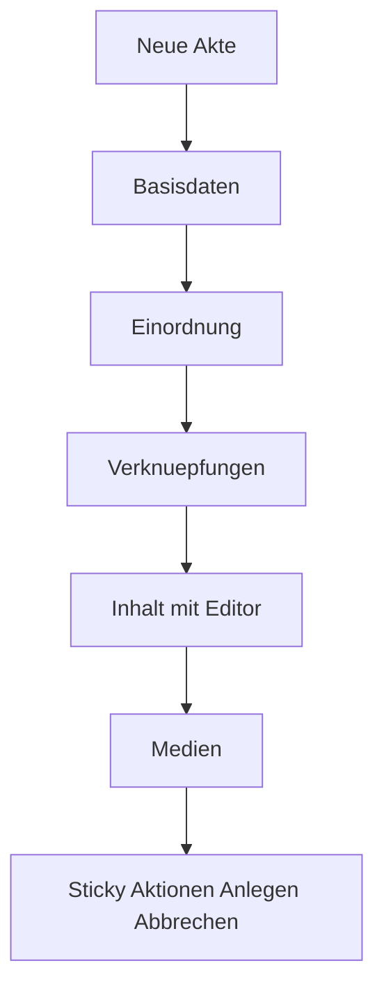

# Create-Seite: Ergonomie & Lesbarkeit (helles Papier-Formular)

## Ziel

Die Seite **Neue Akte** (`/Admin/Articles/Create`) soll funktional und gut lesbar
werden. Der aktuelle Zustand mischt eine helle Papierfläche mit dunklen
Eingabefeldern und ist dadurch schwer lesbar. Zusätzlich werden die Felder
logisch gruppiert und übersichtlicher platziert.

**Scope:** ausschließlich die Create-Seite. Die Bearbeiten-Seite (`Edit`) bleibt
unverändert.

---

## Ursache

- Die Seite nutzt die helle „Akten"-Fläche [`.mv-doc`](../src/BlogCms.Web/wwwroot/css/site.css:1238)
  (Papierfarbe `--mv-paper`, dunkle Schrift).
- Die Formularfelder [`.form-control`](../src/BlogCms.Web/wwwroot/css/site.css:1049)
  sind **global dunkel** (`--mv-bg-card`) mit heller Schrift → dunkle Eingabefelder
  auf hellem Papier.
- Labels [`.form-label`](../src/BlogCms.Web/wwwroot/css/site.css:1067) nutzen
  `--mv-text-dim` (grau) → zu wenig Kontrast auf Papier.
- Der EasyMDE-Editor ist in [`markdown-editor.css`](../src/BlogCms.Web/wwwroot/css/markdown-editor.css:1)
  dunkel gestylt.

---

## Lösung

1. **Create-eigenes Formular-Partial** mit logischen Sektionen (damit `Edit`
   unberührt bleibt).
2. **Seiten-eigenes CSS** `article-create.css`, nur auf Create geladen, alles
   unter der Klasse `.mv-create` gekapselt:
   - helle Eingabefelder (weiß/helles Papier) mit dunkler Schrift,
   - kontrastreiche Labels und Hilfetexte,
   - Sektions-Überschriften und Abstände,
   - responsives Grid für zusammengehörige Felder,
   - Sticky-Aktionsleiste,
   - heller EasyMDE-Editor (überschreibt das dunkle Theme nur auf dieser Seite).

---

## Layout-Struktur (Sektionen)

| Sektion | Felder |
|---|---|
| **Basisdaten** | Titel, Slug, Kurzbeschreibung |
| **Einordnung** | Kategorie, Zugriffsstufe, Status, Geplante Veröffentlichung |
| **Verknüpfungen** | Tags, Hashtags |
| **Inhalt** | Inhalt (Markdown-Editor) |
| **Medien** | Titelbild-URL, Titelbild hochladen, Video-URL, weitere Bilder |
| **Aktionen** | Anlegen / Abbrechen (sticky am unteren Rand) |

---

## CSS-Anpassungen (nur `.mv-create`)

- **Felder:** `background: #fff`, `color: var(--mv-ink)`, sichtbarer Rand
  `rgba(11,12,14,.25)`; Fokus: roter Rand + dezenter Glow.
- **Labels:** `color: var(--mv-ink)` (bzw. dunkles Grau), Mono-Stil bleibt.
- **Hilfetexte (`.form-text`):** dunkles Grau mit ausreichendem Kontrast.
- **Validierung (`.mv-text-danger`):** dunkelroter Ton `#8e1728` (wie auf Papier).
- **Sektionen:** Überschrift in Mono/Uppercase mit Trennlinie, klare Abstände.
- **Grid:** `display: grid` mit `auto-fit`/feste Spalten; auf Mobil einspaltig.
- **Aktionsleiste:** `position: sticky; bottom: 0`, Papierhintergrund, obere
  Trennlinie, `z-index`.
- **EasyMDE hell:** `.mv-create .EasyMDEContainer .CodeMirror` etc. auf hellen
  Hintergrund/dunkle Schrift; Toolbar und Vorschau hell.

---

## Betroffene Dateien

| Datei | Art |
|---|---|
| [`Admin/Articles/_ArticleFormFieldsCreate.cshtml`](../src/BlogCms.Web/Pages/Admin/Articles/_ArticleFormFieldsCreate.cshtml:1) | neu (sektionierte Felder) |
| [`Admin/Articles/Create.cshtml`](../src/BlogCms.Web/Pages/Admin/Articles/Create.cshtml:1) | ändern (neues Partial, `mv-create`, CSS-Link) |
| [`wwwroot/css/article-create.css`](../src/BlogCms.Web/wwwroot/css/article-create.css:1) | neu |
| [`Admin/Articles/_ArticleFormFields.cshtml`](../src/BlogCms.Web/Pages/Admin/Articles/_ArticleFormFields.cshtml:1) | **unverändert** (Edit) |
| [`Admin/Articles/Edit.cshtml`](../src/BlogCms.Web/Pages/Admin/Articles/Edit.cshtml:1) | **unverändert** |

> Hinweis: Das Create-Partial dupliziert die Feld-Definitionen bewusst, um die
> Bearbeiten-Seite nicht zu berühren. Bei künftigen Feldänderungen sind beide
> Partials zu pflegen.

---

## Akzeptanzkriterien

- [ ] Auf `/Admin/Articles/Create` sind alle Eingabefelder hell mit dunkler,
      gut lesbarer Schrift.
- [ ] Labels und Hilfetexte haben auf der Papierfläche ausreichenden Kontrast.
- [ ] Der Markdown-Editor ist auf dieser Seite hell (dunkle Schrift).
- [ ] Die Felder sind in logische Sektionen gruppiert und übersichtlich platziert.
- [ ] Die Aktionsleiste (Anlegen/Abbrechen) ist beim Scrollen erreichbar.
- [ ] Mobil ist das Layout einspaltig und ohne horizontalen Scroll.
- [ ] Die Bearbeiten-Seite (`Edit`) ist optisch unverändert.
- [ ] `dotnet build` und `dotnet test` bleiben grün.
