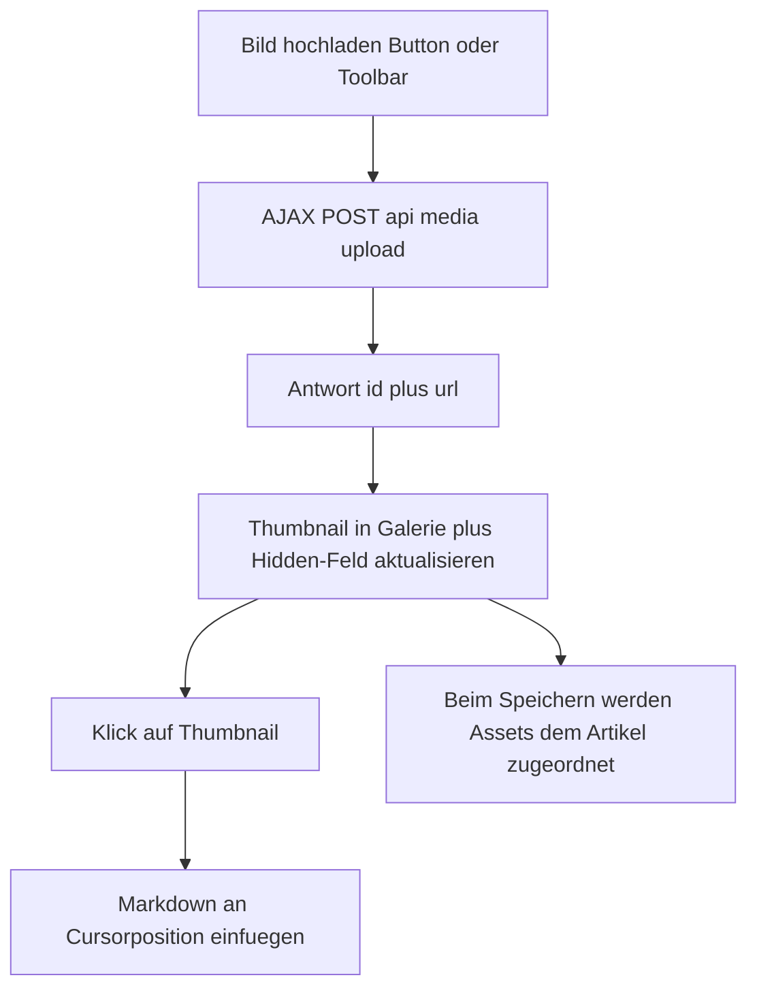

> **Commit:** `407dcf1cefc3325fdc1698b62ae739b2e87a2681` (2026-09-28)

# Create-Seite: Bildergalerie zum Einfügen in den Beitrag

## Ziel

Nach dem Hochladen von Bildern sollen diese auf der Seite **Neue Akte**
(`/Admin/Articles/Create`) sichtbar sein. Ein Klick auf ein Bild fügt es an der
aktuellen **Cursorposition** in den Markdown-Text ein.

**Scope:** ausschließlich die Create-Seite. Die Bearbeiten-Seite bleibt
unverändert.

---

## Ursache

- Der Hinweis am Feld **„Weitere Bilder hochladen"** verweist auf eine
  „Bilderverwaltung", die es nur auf der **Bearbeiten**-Seite gibt. Auf Create
  existiert keine Anzeige hochgeladener Bilder.
- Editor-Uploads (AJAX über den Bild-Button der Toolbar) werden zwar sofort als
  Markdown eingefügt, aber nirgends als Auswahl angezeigt — ein erneutes
  Einfügen an anderer Stelle ist nicht möglich.

---

## Lösung

1. **Neue Sektion „Bilder"** im Create-Partial mit:
   - Button **„Bild hochladen"** (AJAX, gleicher Endpunkt `/api/media/upload`),
   - **Thumbnail-Galerie** aller in dieser Sitzung hochgeladenen Bilder,
   - **Klick auf ein Thumbnail** fügt `` an der Cursorposition ein.
2. **`markdown-editor.js` erweitern:** Galerie verwalten, Upload-Button
   verdrahten, Klick-Einfügen über `editor.codemirror.replaceSelection(...)`.
3. **Persistenz** über ein Hidden-Feld `UploadedImagesJson` (JSON-Liste
   `{id,url,alt}`), damit die Galerie einen Validierungsfehler übersteht.
4. **Redundantes Feld `ContentImageUploads` aus Create entfernen** — sein Hinweis
   war irreführend; der Editor-Upload + Galerie ersetzt es.
5. **CSS** für die Galerie in `article-create.css`.

---

## Ablauf

---

## Komponenten

### 1. Create-Partial (`_ArticleFormFieldsCreate.cshtml`)

- Neue Sektion **„Bilder"** (zwischen „Inhalt" und „Medien"):
  - Button `data-editor-images-upload` („Bild hochladen"),
  - Hinweistext („Klicke ein Bild, um es an der Cursorposition einzufügen."),
  - Galerie-Container `data-editor-images-grid` (initial leer/versteckt),
  - Leer-Hinweis `data-editor-images-empty`.
- Hidden-Feld `asp-for="UploadedImagesJson"`.
- Feld `ContentImageUploads` entfernen.

### 2. Modell (`ArticleInputModel.cs`)

- Neue Eigenschaft `public string? UploadedImagesJson { get; set; }`
  (JSON-Liste der hochgeladenen Bilder; nur clientseitig genutzt, round-trip
  über das Formular).

### 3. JavaScript (`markdown-editor.js`)

- In-Memory-Liste `uploadedImages` (aus `UploadedImagesJson` initialisiert).
- `renderGallery()`: Thumbnails rendern, Leer-Hinweis steuern.
- `addImage({id,url,alt})`: zur Liste hinzufügen, Hidden-Feld + Galerie
  aktualisieren (auch aus `uploadImage` heraus aufrufen).
- Upload-Button `data-editor-images-upload`: verstecktes File-Input öffnen und
  über die bestehende `uploadImage`-Funktion hochladen.
- Klick auf Thumbnail: `editor.codemirror.replaceSelection('')`.
- Ohne Galerie-Container (z. B. auf Edit) wird der Galerie-Teil übersprungen.

### 4. CSS (`article-create.css`)

- `.mv-create__images` (Panel), `.mv-create__images-grid`
  (`grid`, `auto-fill`, `minmax(96px, 1fr)`), `.mv-create__images-item`
  (Button mit Thumbnail, `cursor: pointer`, Hover/Fokus-Rahmen),
  `.mv-create__images-empty`.

---

## Betroffene Dateien

| Datei | Art |
|---|---|
| [`Admin/Articles/_ArticleFormFieldsCreate.cshtml`](../src/BlogCms.Web/Pages/Admin/Articles/_ArticleFormFieldsCreate.cshtml:1) | ändern (Sektion „Bilder", Hidden-Feld, ContentImageUploads raus) |
| [`Models/ArticleInputModel.cs`](../src/BlogCms.Web/Models/ArticleInputModel.cs:1) | ändern (`UploadedImagesJson`) |
| [`wwwroot/js/markdown-editor.js`](../src/BlogCms.Web/wwwroot/js/markdown-editor.js:1) | ändern (Galerie-Logik) |
| [`wwwroot/css/article-create.css`](../src/BlogCms.Web/wwwroot/css/article-create.css:1) | ändern (Galerie-Styles) |
| [`Admin/Articles/Edit.cshtml`](../src/BlogCms.Web/Pages/Admin/Articles/Edit.cshtml:1) / [`_ArticleFormFields.cshtml`](../src/BlogCms.Web/Pages/Admin/Articles/_ArticleFormFields.cshtml:1) | **unverändert** |

---

## Akzeptanzkriterien

- [ ] Nach dem Hochladen erscheint das Bild als Thumbnail in der Sektion „Bilder".
- [ ] Ein Klick auf ein Thumbnail fügt `` an der Cursorposition ein.
- [ ] Mehrere Uploads werden alle angezeigt.
- [ ] Nach einem Validierungsfehler bleibt die Galerie erhalten.
- [ ] Ohne JavaScript bleibt das Formular nutzbar (Editor als Textfeld).
- [ ] Die Bearbeiten-Seite ist unverändert.
- [ ] `dotnet build` und `dotnet test` bleiben grün.
