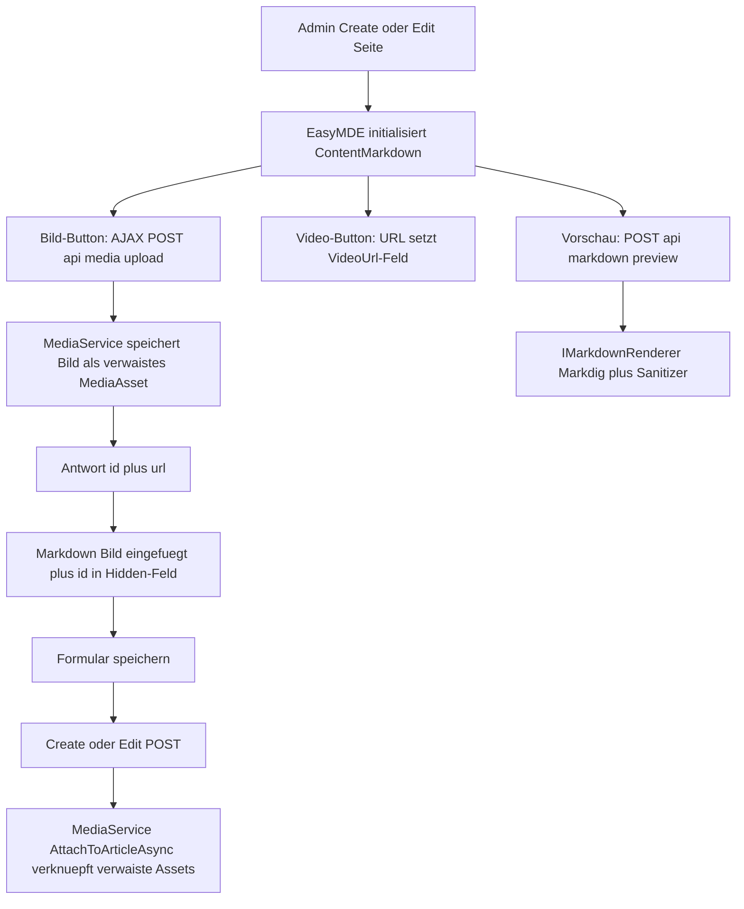

> **Commit:** `407dcf1cefc3325fdc1698b62ae739b2e87a2681` (2026-09-28)

# Markdown-Editor für Beiträge (WYSIWYG-Vorschau, Bilder & Videos)

## Ziel

Beim Verfassen und Bearbeiten von Beiträgen soll der Markdown-Inhalt komfortabel
in einem **formatierten Modus** (Editor + Live-Vorschau) gepflegt werden können.
Bilder und Videos sollen direkt im UI eingefügt werden. Bestehende Beiträge
müssen nachträglich editierbar bleiben.

**Leitprinzipien:** KISS, vorhandenen Editor verwenden (nicht neu erfinden),
progressive Enhancement (ohne JS bleibt das Formular nutzbar), keine
Backend-/Datenmodell-Änderungen.

---

## Editor-Wahl: EasyMDE

[EasyMDE](https://github.com/Ionaru/easy-markdown-editor) (gepflegter Fork von
SimpleMDE) wird verwendet. Begründung:

- **Ein JS + ein CSS**, per LibMan (jsdelivr) einbindbar — passt zur bestehenden
  Client-Bibliotheksverwaltung ([`libman.json`](../src/BlogCms.Web/libman.json:1)),
  kein Build-Schritt (kein npm/Webpack).
- **Wraps ein vorhandenes `<textarea>`** → progressive Enhancement: ohne JS
  bleibt das normale Textfeld ([`ContentMarkdown`](../src/BlogCms.Web/Pages/Admin/Articles/_ArticleFormFields.cshtml:68))
  voll funktionsfähig.
- **Side-by-Side-Vorschau** (formatted mode) + Vollbild-Vorschau.
- **`imageUploadFunction`-Hook** für AJAX-Bild-Upload.
- **Eigene Toolbar-Buttons** möglich (Video).
- **Reines Markdown** als Inhalt (kein HTML-Umschreiben) → passt exakt zum
  serverseitigen Markdig-Rendering ([`MarkdownRenderer`](../src/BlogCms.Infrastructure/Content/MarkdownRenderer.cs:21)).
- Funktioniert automatisch für **Create und Edit**, da beide dasselbe Partial
  [`_ArticleFormFields.cshtml`](../src/BlogCms.Web/Pages/Admin/Articles/_ArticleFormFields.cshtml:1) nutzen.

Für die Toolbar-Icons wird **FontAwesome 4.7** (self-hosted via LibMan) ergänzt,
da EasyMDE `fa fa-*`-Klassen verwendet. Beide Bibliotheken werden **nur auf den
Admin-Artikel-Seiten** geladen (nicht auf der öffentlichen Seite).

---

## Architektur / Ablauf



---

## Komponenten

### 1. Client-Bibliotheken (LibMan)

[`libman.json`](../src/BlogCms.Web/libman.json:1) um zwei Einträge erweitern:

- `easymde@2.18.0` → `wwwroot/lib/easymde/` (`dist/easymde.min.js`, `dist/easymde.min.css`)
- `font-awesome@4.7.0` → `wwwroot/lib/font-awesome/` (`css/font-awesome.min.css`, `fonts/*`)

Der Restore läuft automatisch beim `dotnet build` (siehe [`RUNNING.md`](../RUNNING.md:12)).

### 2. Neuer Upload-Endpunkt

`src/BlogCms.Web/Controllers/MediaController.cs` (neu):

- `POST /api/media/upload` — `[Authorize(Policy = Policies.RequireAuthor)]`,
  `[ValidateAntiForgeryToken]`.
- Nimmt `IFormFile file`, ruft `IMediaService.UploadAsync(...)` mit
  `OwnerType = Article` und **`ArticleId = null`** (verwaistes Asset) auf.
- Antwort: `{ id, url }` (URL via `IMediaService.GetUrl`).
- Fehler → `400` mit `{ error }`.

### 3. Neuer Vorschau-Endpunkt

`src/BlogCms.Web/Controllers/MarkdownController.cs` (neu):

- `POST /api/markdown/preview` — `[Authorize(Policy = Policies.RequireAuthor)]`,
  `[ValidateAntiForgeryToken]`.
- Nimmt `markdown` (Form-Feld), gibt `{ html }` zurück.
- Nutzt den **vorhandenen** [`IMarkdownRenderer`](../src/BlogCms.Infrastructure/Content/MarkdownRenderer.cs:9)
  → Vorschau entspricht exakt der späteren Ausgabe (inkl. Sanitizing).

### 4. Verwaiste Assets verknüpfen

[`IMediaService`](../src/BlogCms.Infrastructure/Media/MediaService.cs:16) erweitern:

```csharp
Task<int> AttachToArticleAsync(
    IEnumerable<Guid> assetIds, Guid articleId, Guid uploadedByUserId,
    CancellationToken cancellationToken = default);
```

Implementierung: lädt Assets mit `Id in assetIds && ArticleId == null &&
UploadedByUserId == uploadedByUserId`, setzt `ArticleId`, speichert. Sicherheit:
nur eigene, noch nicht zugeordnete Assets werden übernommen.

### 5. Formular-Modell

[`ArticleInputModel`](../src/BlogCms.Web/Models/ArticleInputModel.cs:8) ergänzen:

```csharp
[Display(Name = "Hochgeladene Bilder")]
public string? UploadedImageIds { get; set; }   // kommagetrennte GUIDs
```

### 6. Formular-Partial

[`_ArticleFormFields.cshtml`](../src/BlogCms.Web/Pages/Admin/Articles/_ArticleFormFields.cshtml:1):

- Hidden-Feld für `UploadedImageIds` ergänzen.
- Hinweistext am `ContentMarkdown`-Feld: Editor mit Vorschau, Bilder über die
  Toolbar einfügbar.
- Das bestehende Feld `ContentImageUploads` bleibt als **No-JS-Fallback** erhalten.

### 7. Editor-Initialisierung

`src/BlogCms.Web/wwwroot/js/markdown-editor.js` (neu):

- Initialisiert EasyMDE auf `#ContentMarkdown`, falls vorhanden.
- `autoDownloadFontAwesome: false` (FontAwesome self-hosted).
- Toolbar: Standard-Buttons + `image` (nutzt `imageUploadFunction`) + eigener
  `video`-Button + `preview`/`side-by-side`/`fullscreen`.
- `imageUploadFunction`: POST an `/api/media/upload` (mit Antiforgery-Token),
  fügt `` ein und hängt die `id` an `UploadedImageIds` an.
- `video`-Button: fragt URL ab, setzt das `VideoUrl`-Feld und fügt einen
  Markdown-Verweis an der Cursorposition ein.
- `previewRender`: async POST an `/api/markdown/preview`; Fallback auf leeren
  String bei Fehler.
- Ohne JS / ohne EasyMDE: keine Aktion (Textfeld bleibt nutzbar).

### 8. Dark-Theme-Anpassung

`src/BlogCms.Web/wwwroot/css/markdown-editor.css` (neu): dezente Overrides
(Hintergrund, Textfarbe, Rahmen, Toolbar) passend zum dunklen Akten-Design.
Wird nur auf den Admin-Seiten geladen.

### 9. Seiten-Einbindung

[`Create.cshtml`](../src/BlogCms.Web/Pages/Admin/Articles/Create.cshtml:1) und
[`Edit.cshtml`](../src/BlogCms.Web/Pages/Admin/Articles/Edit.cshtml:1):

- `@section Head`: FontAwesome-CSS + EasyMDE-CSS + `markdown-editor.css`.
- `@section Scripts`: EasyMDE-JS + `markdown-editor.js` (nach `_ValidationScriptsPartial`).

### 10. Verknüpfen beim Speichern

[`Create.cshtml.cs`](../src/BlogCms.Web/Pages/Admin/Articles/Create.cshtml.cs:46)
und [`Edit.cshtml.cs`](../src/BlogCms.Web/Pages/Admin/Articles/Edit.cshtml.cs:88):

- Nach dem Anlegen/Aktualisieren `UploadedImageIds` parsen und
  `IMediaService.AttachToArticleAsync(ids, articleId, currentUserId)` aufrufen.
- Bestehende Logik (Titelbild, `ContentImageUploads`, Video) bleibt unverändert.

---

## Betroffene Dateien

| Datei | Art |
|---|---|
| [`libman.json`](../src/BlogCms.Web/libman.json:1) | ändern (2 Libraries) |
| [`Controllers/MediaController.cs`](../src/BlogCms.Web/Controllers/MediaController.cs:1) | neu |
| [`Controllers/MarkdownController.cs`](../src/BlogCms.Web/Controllers/MarkdownController.cs:1) | neu |
| [`Media/MediaService.cs`](../src/BlogCms.Infrastructure/Media/MediaService.cs:16) | ändern (AttachToArticleAsync) |
| [`Models/ArticleInputModel.cs`](../src/BlogCms.Web/Models/ArticleInputModel.cs:8) | ändern (UploadedImageIds) |
| [`Admin/Articles/_ArticleFormFields.cshtml`](../src/BlogCms.Web/Pages/Admin/Articles/_ArticleFormFields.cshtml:1) | ändern |
| [`Admin/Articles/Create.cshtml`](../src/BlogCms.Web/Pages/Admin/Articles/Create.cshtml:1) | ändern (Head/Scripts) |
| [`Admin/Articles/Edit.cshtml`](../src/BlogCms.Web/Pages/Admin/Articles/Edit.cshtml:1) | ändern (Head/Scripts) |
| [`Admin/Articles/Create.cshtml.cs`](../src/BlogCms.Web/Pages/Admin/Articles/Create.cshtml.cs:46) | ändern (Claim) |
| [`Admin/Articles/Edit.cshtml.cs`](../src/BlogCms.Web/Pages/Admin/Articles/Edit.cshtml.cs:88) | ändern (Claim) |
| [`wwwroot/js/markdown-editor.js`](../src/BlogCms.Web/wwwroot/js/markdown-editor.js:1) | neu |
| [`wwwroot/css/markdown-editor.css`](../src/BlogCms.Web/wwwroot/css/markdown-editor.css:1) | neu |
| [`RUNNING.md`](../RUNNING.md:1) / [`docs/02-admin-artikelverwaltung.md`](../docs/02-admin-artikelverwaltung.md:1) | Doku ergänzen |

---

## Bewusste Entscheidungen / Abgrenzung

- **Kein Datenmodell-/Migrations-Änderung.** Verwaiste Assets werden über ein
  Hidden-Feld beim Speichern zugeordnet.
- **Vorschau serverseitig** über den vorhandenen Renderer → konsistent, keine
  zusätzliche JS-Render-Bibliothek.
- **`ContentImageUploads` bleibt** als No-JS-Fallback und für Massen-Upload.
- **Verwaiste Assets** (Formular abgebrochen) bleiben vorerst liegen; eine
  Aufräum-Strategie ist optionaler Ausblick, nicht Teil dieses Plans.
- **Nur Admin-Seiten** laden Editor/FontAwesome → öffentliche Seite unberührt.

---

## Akzeptanzkriterien

- [ ] Beim Anlegen und Bearbeiten erscheint der Markdown-Editor mit Toolbar.
- [ ] Side-by-Side-Vorschau zeigt formatierten Inhalt; entspricht der Ausgabe.
- [ ] Bilder lassen sich per Toolbar-Button hochladen und werden als
      `` an der Cursorposition eingefügt.
- [ ] Hochgeladene Bilder erscheinen nach dem Speichern in der Bilderverwaltung
      und als Artikel-Galerie.
- [ ] Video-Button setzt die Video-URL; das Video wird wie bisher eingebettet.
- [ ] Bestehende Beiträge werden mit ihrem Inhalt im Editor geladen und sind
      editierbar.
- [ ] Ohne JavaScript bleibt das Formular (Textfeld + Datei-Upload) nutzbar.
- [ ] `dotnet build` und `dotnet test` bleiben grün.
