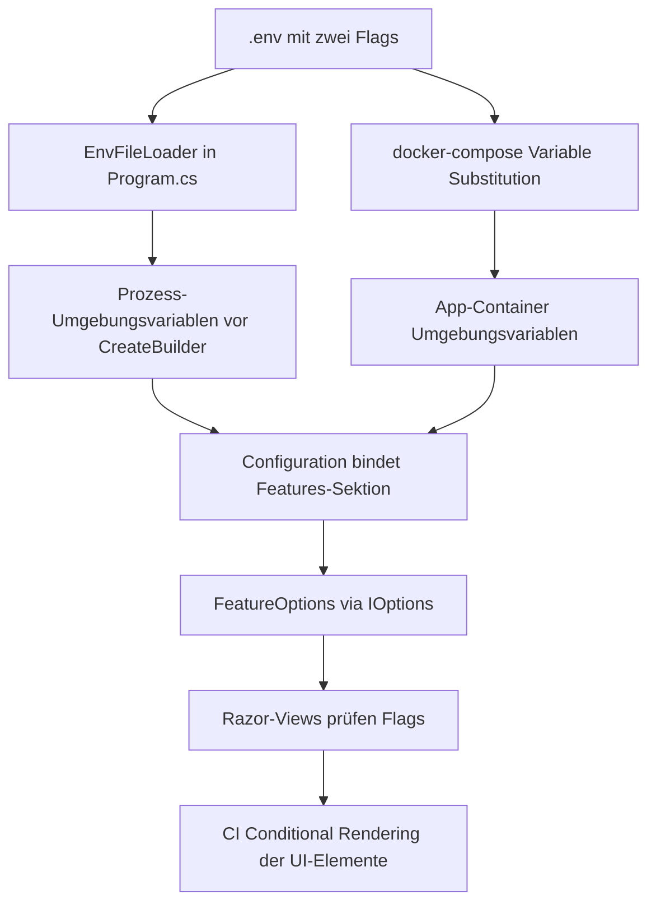

# Feature-Flags: Monetarisierung & Login im UI ausblenden

## Ziel

Über **zwei Parameter in der `.env`-Datei** soll steuerbar sein, ob die
Monetarisierung und der Login im UI sichtbar sind:

| Flag (in `.env`) | Config-Key | Wirkung bei `false` |
|---|---|---|
| `Features__MonetizationEnabled` | `Features:MonetizationEnabled` | Mitgliedschaft-, Spenden- und Premium-CTA im UI werden nicht gerendert |
| `Features__LoginEnabled` | `Features:LoginEnabled` | Anmelden-/Registrieren-Links und Anmelde-Hinweise werden nicht gerendert |

Wichtig: Es wird **nur die Sichtbarkeit im UI** gesteuert. Routen, Seiten,
Services, Paywall-Logik und Policies bleiben vollständig funktionsfähig. Die
Login-Seite (`/Account/Login`) und alle Monetarisierungsseiten bleiben per
direkter URL weiterhin erreichbar.

Standard (falls kein Flag gesetzt): **beide `true`** → bisheriges Verhalten.

## Mechanik

- `.env` verwendet die .NET-Konvention `__` als Trenner:
  `Features__MonetizationEnabled=true`.
- Ein **kleiner eigener Loader** (keine neue NuGet-Abhängigkeit) liest die `.env`
  beim Start **vor** `WebApplication.CreateBuilder` und setzt die Werte als
  Prozess-Umgebungsvariablen. Reale Umgebungsvariablen haben Vorrang (wichtig für
  Docker, wo Compose die Werte setzt).
- Da `CreateBuilder` standardmäßig `AddEnvironmentVariables` nutzt, mappt sich
  `Features__MonetizationEnabled` automatisch auf `Features:MonetizationEnabled`.
- `FeatureOptions` bindet die `Features`-Sektion; per `IOptions<FeatureOptions>`
  stehen die Flags in allen Razor-Views zur Verfügung (`_ViewImports.cshtml`).
- Im Docker-Container wird die `.env` per Compose-Datei an die App durchgereicht.

## Betroffene UI-Stellen (Ausblend-Matrix)

| Datei | Element | gesteuert durch |
|---|---|---|
| [`_Layout.cshtml`](src/BlogCms.Web/Pages/Shared/_Layout.cshtml:49) | Nav-Link **Mitgliedschaft** | Monetization |
| [`_Layout.cshtml`](src/BlogCms.Web/Pages/Shared/_Layout.cshtml:50) | Nav-Link **Spenden** | Monetization |
| [`_Layout.cshtml`](src/BlogCms.Web/Pages/Shared/_Layout.cshtml:68) | Nav-Link **Anmelden** | Login |
| [`_Layout.cshtml`](src/BlogCms.Web/Pages/Shared/_Layout.cshtml:69) | Nav-Link **Registrieren** | Login |
| [`_Layout.cshtml`](src/BlogCms.Web/Pages/Shared/_Layout.cshtml:61) | Nav-Button **Abmelden** | **bleibt immer sichtbar** |
| [`Index.cshtml`](src/BlogCms.Web/Pages/Index.cshtml:14) | CTA **Mitglied werden** (Landing-Hero) | Monetization |
| [`Articles/Details.cshtml`](src/BlogCms.Web/Pages/Articles/Details.cshtml:56) | Button **Mitglied werden** (Premium-Teaser) | Monetization |
| [`Articles/Details.cshtml`](src/BlogCms.Web/Pages/Articles/Details.cshtml:59) | Button **Anmelden** (Premium-Teaser) | Login |
| [`Articles/Details.cshtml`](src/BlogCms.Web/Pages/Articles/Details.cshtml:65) | Button **Anmelden** (Registered-Teaser) | Login |
| [`Articles/Details.cshtml`](src/BlogCms.Web/Pages/Articles/Details.cshtml:66) | Button **Registrieren** (Registered-Teaser) | Login |
| [`Articles/Details.cshtml`](src/BlogCms.Web/Pages/Articles/Details.cshtml:134) | Hinweis **Melde dich an** (Bewertung) | Login |
| [`Articles/Details.cshtml`](src/BlogCms.Web/Pages/Articles/Details.cshtml:180) | Hinweis **Anmelden** (Kommentare) | Login |
| [`Membership/Index.cshtml`](src/BlogCms.Web/Pages/Membership/Index.cshtml:25) | Button **Einmalig spenden** | Monetization |
| [`Account/Manage/Index.cshtml`](src/BlogCms.Web/Pages/Account/Manage/Index.cshtml:21) | Zeile **Abo-Status** | Monetization |

Hinweis: Bleibt im Premium-Teaser nach dem Ausblenden beider Buttons nichts
Klickbares übrig, bleibt der erklärende Text („Diese Akte ist Premium-Mitgliedern
vorbehalten.") stehen. Das ist gewünscht, da die Seite per Direkt-URL erreichbar ist.

## Umsetzungsschritte

1. `.env.example` (eingecheckt) und `.env` (lokal, ignoriert) mit den beiden Flags
   und Kommentaren anlegen.
2. `.gitignore` um `.env` ergänzen.
3. Neue Klasse `FeatureOptions` unter `src/BlogCms.Web/Configuration/` mit
   `MonetizationEnabled` und `LoginEnabled` (Default `true`).
4. `EnvFileLoader` (statische Helferklasse, ohne NuGet) unter
   `src/BlogCms.Web/Configuration/` implementieren: parst `KEY=VALUE`, ignoriert
   Kommentare/Leerzeilen, entfernt umschließende Quotes, sucht `.env` vom
   Arbeitsverzeichnis aufwärts und setzt Werte nur, wenn sie nicht bereits als
   reale Umgebungsvariable existieren.
5. In `Program.cs` den Loader als erste Anweisung **vor**
   `WebApplication.CreateBuilder(args)` aufrufen.
6. `Features`-Sektion mit Defaults `true` in `appsettings.json` ergänzen
   (Dokumentation/Fallback).
7. In `Program.cs` `builder.Services.Configure<FeatureOptions>(...)` registrieren.
8. `docker-compose.yml`: im `app`-Service die beiden Variablen als
   `Features__MonetizationEnabled: ${Features__MonetizationEnabled:-true}` und
   `Features__LoginEnabled: ${Features__LoginEnabled:-true}` durchreichen.
9. In `_ViewImports.cshtml` `IOptions<FeatureOptions>` injizieren (z. B. als
   `FeatureConfig`), damit alle Views die Flags nutzen können.
10. Razor-Views gemäß Ausblend-Matrix mit `@if (FeatureConfig.Value....)` umbauen.
11. `RUNNING.md` (Abschnitt „Konfiguration") und ggf. `README.md` um die neuen
    `.env`-Flags und ihre Wirkung ergänzen.
12. Optional: Unit-Test für den `EnvFileLoader` in `tests/BlogCms.Tests`.
13. Build und manuelle Prüfung der vier Kombinationen
    (Monetization an/aus × Login an/aus) sowie Direktaufruf `/Account/Login`
    und `/Membership/Index`.

## Risiken / Hinweise

- **Reihenfolge wichtig**: Der Loader muss vor `CreateBuilder` laufen, sonst liest
  die Configuration die Variablen nicht.
- **Vorrang**: Reale Umgebungsvariablen (z. B. aus Docker/Shell) überschreiben die
  `.env`. Das ist Standardverhalten und für Container-Deployments gewünscht.
- **Kein Sicherheits-Gate**: Die Flags sind reine UI-Steuerung. Serverseitige
  Policies/Paywall bleiben unverändert aktiv.
- **`appsettings.json`-Defaults** verhindern, dass bei fehlender `.env` etwas
  verschwindet.
