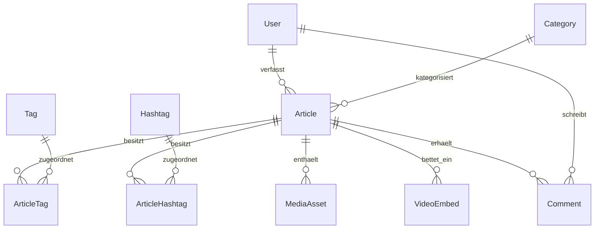
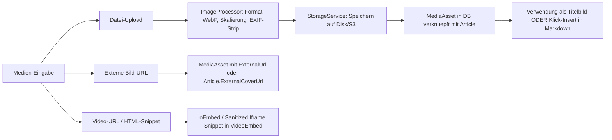

# Umfassender Architektur- und Refactoring-Plan: Artikelverwaltung, Medien und Startseite

## 1. Ausgangslage & Fehlerursachenanalyse

### 1.1 Warum das neu angelegte Posting nicht erschien
1. **Versteckter Validierungsfehler beim Bild-Upload:**
   - In [`ArticleInputModel.HasTitleImageSource`](../src/BlogCms.Web/Models/ArticleInputModel.cs:95) wurde ausschließlich geprüft, ob `TitleImageUrl` gesetzt ist oder eine Datei im File-Input `ImageUpload` liegt.
   - Wurden Bilder über die neue Bilder-Galerie / den Markdown-Editor hochgeladen ([`UploadedImageIds`](../src/BlogCms.Web/Models/ArticleInputModel.cs:67)), lieferte `HasTitleImageSource(false)` fälschlicherweise `false`.
   - Die serverseitige Validierung brach mit einem `ModelState`-Fehler an `ImageUpload` ab.
   - Da im Formular nur `
` eingebunden war und das Input-Feld `ImageUpload` ganz unten im Formular lag, erhielt der Autor oben **keine sichtbare Fehlermeldung**. Der Artikel wurde **überhaupt nicht in der Datenbank gespeichert**.
2. **Textarea-Synchronisation von EasyMDE:**
   - Der EasyMDE-Editor synchronisiert seinen internen CodeMirror-Puffer nicht bei jedem Submit-Event automatisch zurück in das native `<textarea id="ContentMarkdown">`. Ohne expliziten Hook sendete der Browser ein leeres Feld ab, was ebenfalls zur Ablehnung führte.
3. **Doppelte und getrennte Formularlogik:**
   - Es existierten zwei getrennte Formular-Partials: `_ArticleFormFields.cshtml` (Edit) und `_ArticleFormFieldsCreate.cshtml` (Create).
   - Das führte zu unvollständiger Medienverwaltung, redundanter Codebasis und inkonsistenten Verhalten beim Erstellen vs. Bearbeiten.
4. **Fehlende Tabellenbindung für Themengebiete:**
   - Themengebiete (Kategorien) waren bisher ein hartcodiertes Enum (`ArticleCategory`).
   - Die Anforderung verlangt nun ausdrücklich eine saubere Normalisierung in eigenen Tabellen (Themengebiete, Hashtags, Tags), die flexibel mit Beiträgen verknüpft sind.

---

## 2. Zielarchitektur

### 2.1 Datenbankschema & Entitäten (Single Point of Truth)

1. **`Category` (Themengebiete — neu als Entität):**
   - `Id` (GUID)
   - `Name` (z.B. "Politik", "Satire", "Verschwörungstheorien")
   - `Slug` (z.B. "politik", "satire", "verschwoerungstheorien")
   - `Description` (optionaler Beschreibungstext)
   - `DisplayOrder` (int)
   - `Article.CategoryId` (FK auf `Category`)

2. **`Article` (Beitrag):**
   - `Id` (GUID)
   - `Title` (string, max 300)
   - `Slug` (string, unique)
   - `Excerpt` (Kurzbeschreibung/Teaser, Pflicht)
   - `ContentMarkdown` (Markdown-Text, Pflicht)
   - `ContentHtml` (Optional serverseitig gecachter HTML-Stand, sanitisiert)
   - `AccessLevel` (`Public`, `Registered`, `Premium`)
   - `Status` (`Draft`, `Scheduled`, `Published`, `Archived`)
   - `PublishedAt` (DateTime? UTC)
   - `ScheduledAt` (DateTime? UTC)
   - `AuthorId` (FK auf User)
   - `CoverMediaId` (FK auf `MediaAsset`? — das designierte Titelbild)
   - `ExternalCoverUrl` (string? — alternative externe Titelbild-URL)
   - `CreatedAt`, `UpdatedAt`, `DeletedAt` (Soft-Delete)

3. **`MediaAsset` (Durchgängige Medienverwaltung):**
   - `Id` (GUID)
   - `ArticleId` (GUID?, zugeordneter Beitrag)
   - `UploaderId` (GUID, verknüpfter Nutzer)
   - `FileName` (Originaldateiname)
   - `StoragePath` (Pfad auf Disk/S3, z.B. `uploads/2026/09/...`)
   - `Url` (Direkte Zugriffs-URL, lokal `/uploads/...` oder CDN)
   - `ContentType` (MIME-Type, z.B. `image/webp`)
   - `FileSizeBytes` (long)
   - `Width`, `Height` (int?)
   - `AltText` (string?)
   - `IsCover` (bool — markiert das Bild als Titelbild)
   - `CreatedAt`

4. **`VideoEmbed` (Externe Videos / HTML-Snippets):**
   - `Id` (GUID)
   - `ArticleId` (GUID, FK auf Article)
   - `OriginalUrl` (z.B. YouTube, Vimeo)
   - `Platform` (Enum/String)
   - `EmbedHtml` (sanitisiertes iframe-Snippet)
   - `ThumbnailUrl` (optional)
   - `CreatedAt`

5. **`Comment` (Kommentare):**
   - `Id`, `ArticleId`, `UserId`, `ParentCommentId`, `ContentText`, `Status`, `IsHighlighted`, `CreatedAt`, `UpdatedAt`, `DeletedAt`.

---

## 3. Durchgängiges Medienkonzept

- **Titelbild-Erkennung:**
  Ein Beitrag hat ein gültiges Titelbild, sobald:
  1. mindestens ein Bild hochgeladen wurde (das erste wird automatisch Cover, falls keines explizit gewählt ist), **ODER**
  2. eine externe Bild-URL angegeben wurde.
  -> **Kein fälschlicher Validierungsabbruch mehr!**
- **Markdown-Einbettung:**
  Hochgeladene Bilder erscheinen in einer Galerie-Leiste direkt über/neben dem Editor. Ein Klick fügt das Snippet `` an die aktuelle Cursorposition ein.
- **Video-Einbettung:**
  Video-URLs werden automatisch zu sauberen, sandboxed oEmbed-Iframes generiert und können per Tag/Snippet im Fließtext oder unter dem Beitrag dargestellt werden.

---

## 4. Bereinigung & UX-Prozessablauf

### 4.1 Zusammenführung der Formulare
- Löschen von `_ArticleFormFieldsCreate.cshtml` und Bereinigung von `_ArticleFormFields.cshtml`.
- Neues einheitliches Partial `_ArticleForm.cshtml`, das sowohl für **Neu anlegen** als auch für **Bearbeiten** genutzt wird.
- Einheitliche Komponenten:
  - Titel & Slug (Live-Generierung des Slugs bei leerem Feld)
  - Excerpt (Teaser)
  - Themengebiet (Auswahl aus `Category`-Tabelle)
  - Medien-Sektion (Cover-Auswahl, Galerie hochgeladener Bilder, Video-URL)
  - Editor mit automatischer Form-Submit-Synchronisation
  - Tags & Hashtags
  - Vollständiges `asp-validation-summary="All"` oben im Formular mit klaren Fehlermeldungen.

### 4.2 Klare Veröffentlichungsaktionen
- Im Formular gibt es drei eindeutige Aktionen:
  1. **„Sofort veröffentlichen"** (`asp-page-handler="Publish"`):
     - Status = `Published`
     - `PublishedAt` = `DateTime.UtcNow`
     - Sofort auf der Startseite sichtbar
  2. **„Als Entwurf speichern"** (`asp-page-handler="Draft"`):
     - Status = `Draft`
     - Bleibt im Admin-Bereich als Entwurf bearbeitbar
  3. **„Planen"** (`asp-page-handler="Schedule"`):
     - Bei Angabe eines Zukunftsdatums Status = `Scheduled`

### 4.3 Übersicht `/Admin/Articles`
- Tabellarische Auflistung aller Artikel mit:
  - Thumbnail des Titelbilds
  - Titel (klickbar)
  - Autor (für Admins)
  - Themengebiet / Kategorie
  - Status-Pill (Veröffentlicht / Entwurf / Geplant)
  - Datum (Veröffentlicht / Geplant / Erstellt)
  - Aktionen: Ansehen (neuer Tab), Bearbeiten, Löschen.
- Schnelle Tabs zur Filterung: *Alle*, *Veröffentlicht*, *Entwürfe*, *Geplant*.

### 4.4 Startseite (`/`)
- Zeigt sofort alle neu veröffentlichten Beiträge in den Kacheln an.
- Sortiert absteigend nach `PublishedAt` (mit stabiler Sekundärsortierung nach `CreatedAt` und `Id`).
- Klick auf die Kachel öffnet den Beitrag unter `/Articles/Details?slug={slug}`.

---

## 5. Geplante Arbeitsschritte

1. **Datenbank & Migration:**
   - Entity `Category` erstellen, `Article.CategoryId` verknüpfen.
   - EF Core Migration generieren (oder bereinigte Initial-Migration), Seed-Daten für Standard-Themengebiete (Politik, Satire, Verschwörungstheorien).
   - EF Model & `AppDbContext` aktualisieren.
2. **Backend & Repositories (`ArticleService`, `MediaService`):**
   - Bereinigung der Validierungs- und Veröffentlichungslogik.
   - Einheitliche Titelbild-Auflösung: Uploads haben Vorrang oder externe URL; erstes hochgeladenes Bild dient als Standard-Cover.
   - Stabilisierung aller Queries für Startseite und Suche.
3. **UI-Bereinigung (`Admin/Articles`):**
   - Konsolidierung von `_ArticleFormFieldsCreate.cshtml` und `_ArticleFormFields.cshtml` in `_ArticleForm.cshtml`.
   - Einbindung der klaren Workflow-Buttons (Veröffentlichen, Entwurf, Planen).
   - EasyMDE-Formular-Synchronisation absichern.
   - Optimierung der Aktenliste unter `/Admin/Articles`.
4. **End-to-End Verifikation & Tests:**
   - Testfall: Artikel anlegen mit Bild-Upload über Editor -> Sofort veröffentlichen -> Auf Startseite und in Admin-Liste prüfen.
   - Testfall: Artikel als Entwurf speichern -> In Admin-Liste als Entwurf, nicht auf Startseite.
   - Gesamte Testsuite durchlaufen lassen.
