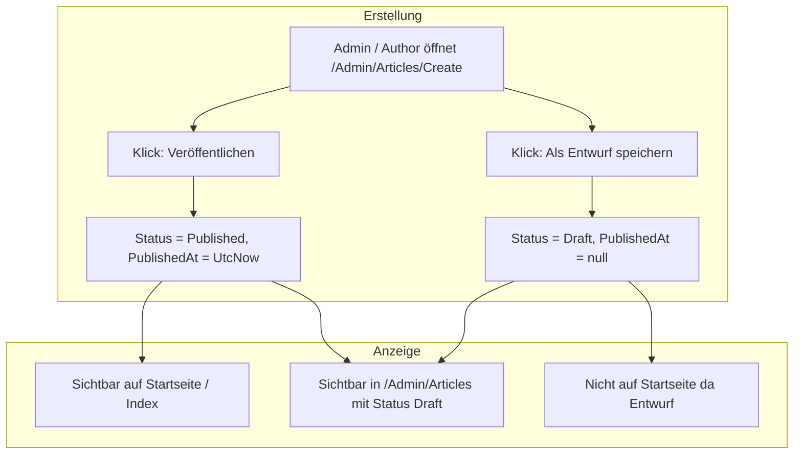

# Plan: Refactoring Artikelverwaltung (/Admin/Articles) und Beitragsdarstellung auf der Startseite

## 1. Analyse & Problembeschreibung

### 1.1 Darstellungsprobleme unter `/Admin/Articles`
1. **Kritischer Kontrastfehler (CSS):**
   Die Tabelle in [`/Admin/Articles/Index.cshtml`](../src/BlogCms.Web/Pages/Admin/Articles/Index.cshtml:27) ist in ein `.mv-doc`-Element eingebettet. `.mv-doc` besitzt einen hellen Papier-Hintergrund (`--mv-paper: #e8e3d6`). Die CSS-Klasse `.table` in [`site.css`](../src/BlogCms.Web/wwwroot/css/site.css:1220) überschreibt `--bs-table-color: var(--mv-text)` (`#e7e4db`, helles Weißgrau) und setzt `thead th` auf `var(--mv-text-dim)` (`#9a978f`). Das führt dazu, dass fast weißer Text auf hellem Grund gerendert wird. Die Einträge der Aktenverwaltung sind visuell praktisch unsichtbar.
2. **Fehlende Kontextspalten & Formatierung:**
   - In der Admin-Sicht (`Model.IsAdmin`) fehlt die Spalte **Autor** – der Administrator sieht alle Akten, weiß aber in der Tabelle nicht, wer sie verfasst hat ([`FeatureFix1.MD`](../FeatureFix1.MD:120)).
   - Die Zugriffsstufe wird als rohes Enum (`Public`, `Registered`, `Premium`) ausgegeben, statt konsistent wie auf den Karten die Hilfsfunktion [`ArticleDisplay.AccessLabel(...)`](../src/BlogCms.Web/Content/ArticleDisplay.cs:28) zu nutzen.
   - Es fehlt eine direkte Vorschau-/Ansehen-Aktion für bereits veröffentlichte Beiträge.

### 1.2 Warum neu angelegte Beiträge nicht auf der Startseite erscheinen
1. **Standardstatus beim Anlegen ist `Draft`:**
   In [`ArticleInputModel.cs`](../src/BlogCms.Web/Models/ArticleInputModel.cs:37) ist `Status = ArticleStatus.Draft`.
   Auf [`/Admin/Articles/Create`](../src/BlogCms.Web/Pages/Admin/Articles/Create.cshtml:22) existiert lediglich ein Submit-Button „Anlegen". Wenn Autoren ein Formular ausfüllen und „Anlegen" klicken, ohne das Dropdown manuell auf `Published` umzustellen, wird der Artikel als **Entwurf** (`Draft`) gespeichert.
2. **Strikte Filterung auf der Startseite:**
   Auf der Startseite lädt [`Index.cshtml.cs`](../src/BlogCms.Web/Pages/Index.cshtml.cs:28) über [`ArticleService.SearchPublishedAsync`](../src/BlogCms.Infrastructure/Content/ArticleService.cs:129) ausschließlich Artikel mit `Status == ArticleStatus.Published && PublishedAt != null`. Entwürfe (`Draft`) werden gemäß BR-030/BR-080 bewusst nicht öffentlich angezeigt.
3. **Fehlende Workflow-Buttons:**
   Es fehlt die im CMS-Standard und in BR-013 vorgesehene klare Trennung:
   - Button **„Veröffentlichen"** (speichert und setzt Status direkt auf `Published` mit `PublishedAt = UtcNow`)
   - Button **„Als Entwurf speichern"** (speichert mit Status `Draft`)
4. **Fehlendes Feedback nach dem Anlegen:**
   Die Meldung lautet bisher pauschal `Artikel „X“ wurde angelegt.`, ohne Information über den Publikationsstatus oder einen Direktlink zur Akte / Startseite.
5. **Sortierungsstabilität:**
   In `SearchPublishedAsync` sollte bei `ArticleSortOrder.Newest` ein deterministischer Sekundärschlüssel (`ThenByDescending(a => a.CreatedAt).ThenByDescending(a => a.Id)`) ergänzt werden, falls mehrere Artikel zur gleichen Sekunde veröffentlicht wurden.

---

## 2. Soll-Architektur & Workflow

---

## 3. Geplante Maßnahmen nach Projektstandards

### Schritt 1: CSS-Korrektur für Tabellen auf hellen Flächen ([`site.css`](../src/BlogCms.Web/wwwroot/css/site.css:1220))
- Regeln für `.mv-doc .table` und `.mv-paper .table` definieren:
  - Textfarbe auf `var(--mv-ink)` (`#0b0c0e`) setzen.
  - Tabellenkopf `thead th` mit gut lesbarem Kontrast auf Papier (`rgba(11, 12, 14, 0.75)`).
  - Tabellenränder (`--bs-table-border-color`) auf dezenten dunklen Rand (`rgba(11, 12, 14, 0.15)`) einstellen.
  - Hover-Zustand für Zeilen passend zu Papier gestalten.

### Schritt 2: Optimierung der Aktenliste ([`Admin/Articles/Index.cshtml`](../src/BlogCms.Web/Pages/Admin/Articles/Index.cshtml:27))
- Autor-Spalte hinzufügen (bei `Model.IsAdmin`).
- Titel mit Link zur Bearbeitung oder Ansicht hinterlegen.
- Status mit visuellen Badges / Kennzeichnungen formatieren (Draft, Scheduled, Published, Archived).
- Zugriffsstufe über `ArticleDisplay.AccessLabel(...)` lesbar ausgeben.
- Bei veröffentlichten Beiträgen einen „Ansehen"-Link auf [`/Articles/Details?slug=...`](../src/BlogCms.Web/Pages/Articles/Details.cshtml:1) bereitstellen.

### Schritt 3: Ergonomie & Veröffentlichungs-Workflow beim Anlegen ([`Admin/Articles/Create.cshtml`](../src/BlogCms.Web/Pages/Admin/Articles/Create.cshtml:21) & [`CreateModel.cs`](../src/BlogCms.Web/Pages/Admin/Articles/Create.cshtml.cs:46))
- Zwei dezidierte Aktionen im Formular bereitstellen:
  - Primärbutton: **„Sofort veröffentlichen"** (`asp-page-handler="Publish"`)
  - Sekundärbutton: **„Als Entwurf speichern"** (`asp-page-handler="SaveDraft"`)
- Transparente Erfolgsmeldung in `TempData["Message"]` mit Statusangabe und Direktlink.

### Schritt 4: Robuste Sortierung im Backend ([`ArticleService.cs`](../src/BlogCms.Infrastructure/Content/ArticleService.cs:180))
- Deterministische Sortierung (`ThenByDescending(a => a.CreatedAt)`) in `SearchPublishedAsync`.

### Schritt 5: Verifikation & Tests
- Vorhandene Tests in [`tests/BlogCms.Tests/ContentTests.cs`](../tests/BlogCms.Tests/ContentTests.cs:62) ausführen und ggf. Testfälle für die differenzierte Veröffentlichung ergänzen.
