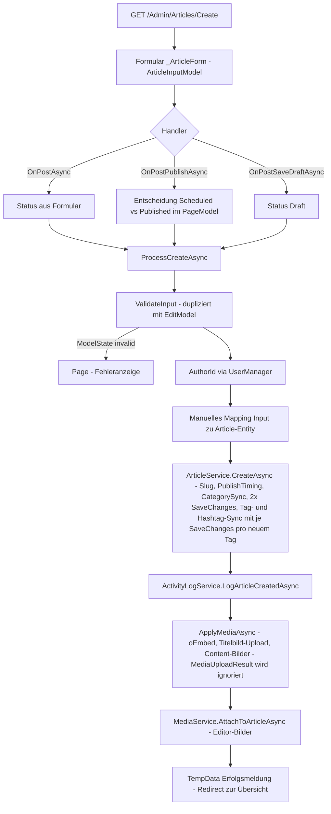
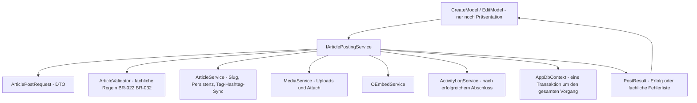

# Refactoring-Plan: Beitrags-Posten-Funktion (Artikel anlegen/bearbeiten)

Stand: Analyse auf Basis von `DataSchema.md` (v1.2), `docs/02-admin-artikelverwaltung.md`,
`docs/03-blog-nuten.md` bzw. `docs/03-blog-nutzen.md`, `plans/refactoring-artikel-workflow-und-medien.md`
und dem aktuellen Codestand. **Der Plan wird nicht selbstständig implementiert — Freigabe erforderlich.**

---

## 1. Ist-Zustand: Datenfluss der Posten-Funktion

### 1.1 Beteiligte Klassen und Abhängigkeiten

| Schicht | Klasse / Datei | Rolle |
|---|---|---|
| Web (Präsentation) | [`CreateModel`](../src/BlogCms.Web/Pages/Admin/Articles/Create.cshtml.cs) | Razor Page `/Admin/Articles/Create`; Handler `OnPostAsync`, `OnPostPublishAsync`, `OnPostSaveDraftAsync` |
| Web (Präsentation) | [`EditModel`](../src/BlogCms.Web/Pages/Admin/Articles/Edit.cshtml.cs) | Razor Page `/Admin/Articles/Edit`; laden, Ownership-Prüfung, Speichern, Bildverwaltung |
| Web (Präsentation) | [`_ArticleForm.cshtml`](../src/BlogCms.Web/Pages/Admin/Articles/_ArticleForm.cshtml) | gemeinsames Formular-Partial für Create und Edit |
| Web (Model) | [`ArticleInputModel`](../src/BlogCms.Web/Models/ArticleInputModel.cs) | Form-Model inkl. Parsing-Logik (`ParseTags`, `ParseHashtags`, `ParseUploadedImageIds`, `HasTitleImageSource`) |
| Infrastructure | [`ArticleService`](../src/BlogCms.Infrastructure/Content/ArticleService.cs) | God-Service: Lese-Queries, Slug-Eindeutigkeit, Create/Update, Tag-/Hashtag-Sync, Category-Sync, VideoEmbed, Publish-Timing, geplante Veröffentlichung |
| Infrastructure | [`MediaService`](../src/BlogCms.Infrastructure/Media/MediaService.cs) | Bild-Upload (Validierung/Verarbeitung/Storage), `AttachToArticleAsync`, Alt-Text, Delete |
| Infrastructure | `OEmbedService` | Auflösung von Video-URLs zu Embed-Code |
| Infrastructure | [`ActivityLogService`](../src/BlogCms.Infrastructure/Activity/ActivityLogService.cs) | `LogArticleCreatedAsync` (DataSchema §13) |
| Infrastructure | [`SlugGenerator`](../src/BlogCms.Infrastructure/Content/SlugGenerator.cs) | Slug-Normalisierung |
| Data | [`AppDbContext`](../src/BlogCms.Infrastructure/Data/AppDbContext.cs) | direkter EF-Core-Zugriff in allen Services |

### 1.2 Ablauf beim Anlegen (Create)



### 1.3 Ablauf beim Bearbeiten (Edit) — weitgehend parallel strukturiert

`OnGetAsync` lädt Artikel + Ownership-Prüfung (BR-013) und mappt Entity → InputModel.
`OnPostAsync` prüft Ownership erneut, validiert (eigene Kopie von `ValidateInput`),
befüllt die Entity manuell, ruft `UpdateAsync`, dann Video/Bild-Logik (eigene Kopie von
`ApplyMediaAsync` als `UploadContentImagesAsync` + Inline-Code) und `AttachToArticleAsync`.

### 1.4 Beobachtungen zum Datenfluss

- **Kein Transaktionsrahmen:** `CreateAsync` führt mehrere `SaveChanges` aus; danach
  folgen ActivityLog, VideoEmbed, Bild-Uploads und Editor-Bild-Zuordnung als
  **voneinander unabhängige** Operationen. Ein Fehler mitten im Ablauf hinterlässt
  einen halbfertigen Artikel (z. B. ohne Tags, ohne Medien).
- **Reihenfolge-Fehler:** `LogArticleCreatedAsync` wird ausgeführt, **bevor** Medien
  angehängt sind — der Log-Eintrag behauptet damit einen Zustand, der noch nicht gilt.
- **Fehlverschluckung:** `MediaService.UploadAsync` liefert `MediaUploadResult`
  (u. a. „Datei zu groß", „Ungültiges Bild") — **beide PageModels ignorieren das
  Ergebnis vollständig**. Der Nutzer sieht eine Erfolgsmeldung, obwohl das Bild
  abgelehnt wurde. Gleiches gilt für oEmbed-Fehler bei `SetVideoEmbedAsync`.
- **Geschäftsregeln im Präsentationslayer:** Die Entscheidung „Scheduled mit
  Zukunftsdatum vs. sofort Published" ([`CreateModel.OnPostPublishAsync`](../src/BlogCms.Web/Pages/Admin/Articles/Create.cshtml.cs:51))
  und die fachliche Validierung (`ValidateInput`) leben im PageModel.
- **Mapping im PageModel:** Entity `Article` wird in beiden PageModels manuell
  Feld für Feld gebaut/befüllt — die Webschicht kennt Entity-Interna.

---

## 2. Priorisierte Problemliste

| Prio | Problem | Ort | Auswirkung |
|---|---|---|---|
| **P1** | `MediaUploadResult` wird ignoriert — fehlgeschlagene Bild-Uploads werden dem Nutzer als Erfolg verkauft | `CreateModel.ApplyMediaAsync`, `EditModel.OnPostAsync` | Datenverlust ohne Rückmeldung; BR-022-Pflicht „Titelbild" kann still brechen |
| **P1** | Kein Transaktions-/Unit-of-Work-Zusammenhang über Artikel + Tags + Medien + Video + Log | `ArticleService.CreateAsync/UpdateAsync`, beide PageModels | Halbfertige Artikel bei Fehlern; inkonsistenter Zustand |
| **P1** | ActivityLog vor Medien-Anhang (logischer Reihenfolgefehler) | `CreateModel.ProcessCreateAsync` | Log-Eintrag beschreibt unvollständigen Artikel |
| **P2** | Duplizierte `ValidateInput` (identisch in Create + Edit) | beide PageModels | Copy-Paste-Drift; Regeländerung muss 2× erfolgen |
| **P2** | Duplizierte Medien-Logik (`ApplyMediaAsync` vs. Inline + `UploadContentImagesAsync`) | beide PageModels | gleiche Drift-Gefahr |
| **P2** | Geschäftslogik im PageModel: Publish-Entscheidung, fachliche Validierung, Entity-Mapping | beide PageModels | Verletzung der Schichttrennung; PageModel-Logik nicht unit-testbar (UserManager/HttpContext-Abhängigkeit) |
| **P2** | `ArticleService` als God-Service (~20 Methoden, Lesen + Schreiben + Slug + Sync + Video + Scheduler) | `ArticleService` | Interface zwingt alle Consumer, alles zu kennen; schwer fokussiert testbar |
| **P2** | Slug-Stabilität verletzt: Bei leerem Slug-Feld erzeugt `UpdateAsync` einen **neuen** Slug aus dem (geänderten) Titel — Doku verspricht „bereits veröffentlichte URLs bleiben stabil" | `ArticleService.UpdateAsync` vs. `docs/02-admin-artikelverwaltung.md` | URL-Bruch bei bereits veröffentlichten Beiträgen |
| **P3** | N+1-`SaveChanges`: pro neuem Tag/Hashtag ein eigener `SaveChanges`; Create/Update insgesamt 2× | `ArticleService.SyncTagsAsync/SyncHashtagsAsync` | unnötige DB-Roundtrips, keine Atomarität |
| **P3** | Doppeltes `#`-Trimming: `ArticleInputModel.ParseHashtags` **und** `SyncHashtagsAsync` trimmen `#` | beide | redundante Logik |
| **P3** | `CategoryId` im InputModel ohne UI-Binding; `SyncCategoryAsync` mappt per String-Parsing des Kategorienamens auf das Enum | `ArticleInputModel`, `ArticleService` | totes Feld + fragiles Mapping (DataSchema: `Category`-Enum ist Quelle der Wahrheit) |
| **P3** | Keine strukturierte Fehlerbehandlung (kein try/catch, keine User-Meldung bei Storage-/oEmbed-Fehlern) | PageModels | unbehandelte Ausnahmen → generische Fehlerseite |

**Bewusst NICHT als Problem eingestuft** (KISS — kein Handlungsbedarf):

- Das gemeinsame Partial `_ArticleForm.cshtml` ist bereits das Ergebnis eines früheren
  Refactorings (siehe `plans/refactoring-artikel-workflow-und-medien.md`) und in Ordnung.
- Die Parsing-Helfer am `ArticleInputModel` sind pragmatisch; sie wandern nur dort um,
  wo sie ohnehin vom PostingService gebraucht werden.
- `IArticleService`-Lese-Methoden (Suche, Listen, Detail) sind außerhalb des Scope.

---

## 3. Refactoring-Zielbild (OOP + KISS)

### 3.1 Prinzipien

- **Trennung der Verantwortlichkeiten:** Präsentation (PageModels) → Anwendungsfälle
  (neuer PostingService) → Datenzugriff (DbContext, MediaService, bestehende Services).
- **KISS:** genau **ein** neuer Anwendungsservice, **ein** Request-DTO, **ein**
  Ergebnis-Typ. Keine Repository-Schicht, kein Mediator, kein zusätzliches
  Abstraktionsniveau über die bestehende Architektur hinaus.
- **Kompatibilität zu `DataSchema.md`:** keine Schema-Änderung. Alle Felder
  (`TitleImageUrl`, `AccessLevel`, `Status`, `ScheduledAt`, `Category`-Enum,
  Tag/Hashtag-Joins, `ActivityLogEntry`) bleiben unverändert. `IsPremium` bleibt
  abgeleitet. Soft-Delete bleibt unberührt.

### 3.2 Neue Struktur (Infrastructure-Layer, Namespace `BlogCms.Infrastructure.Content`)



#### Neue Typen

1. **`ArticlePostRequest`** (record, Infrastructure-Layer — analog zum bereits dort
   lebenden `ArticleQuery`):
   ```csharp
   public sealed record ArticlePostRequest(
       string Title,
       string? Slug,
       string? TitleImageUrl,
       string Excerpt,
       string ContentMarkdown,
       ArticleCategory Category,
       ArticleAccessLevel AccessLevel,
       ArticleStatus Status,
       DateTime? ScheduledAt,
       IReadOnlyList<string> Tags,
       IReadOnlyList<string> Hashtags,
       string? VideoUrl,
       IFormFile? CoverUpload,                 // nur Web-Layer befüllt
       IReadOnlyList<IFormFile> ContentUploads,
       IReadOnlyList<Guid> UploadedImageIds);
   ```
   Das PageModel mappt `ArticleInputModel` → `ArticlePostRequest` (reines Zuordnen,
   keine Logik). Parsing der Tag-/Hashtag-Strings wandert als statische Helfer in
   `ArticlePostRequest` (ein Ort statt zwei).

2. **`PostResult`** (record):
   ```csharp
   public sealed record PostResult(
       bool Succeeded,
       Article? Article,
       IReadOnlyList<PostError> Errors);
   public sealed record PostError(string Field, string Message);
   ```
   `Field` entspricht dem Property-Namen des `ArticleInputModel`, sodass das PageModel
   Fehler 1:1 in `ModelState.AddModelError(Field, Message)` übernehmen kann.

3. **`IArticlePostingService`** (Interface + Implementierung `ArticlePostingService`):
   ```csharp
   public interface IArticlePostingService
   {
       Task<PostResult> CreateAsync(ArticlePostRequest request, Guid authorId,
           CancellationToken ct = default);

       Task<PostResult> UpdateAsync(Guid articleId, ArticlePostRequest request,
           Guid actorId, bool isAdministrator, CancellationToken ct = default);

       /// <summary>Fachliche Regeln BR-022 / BR-032, von Create und Edit geteilt.</summary>
       IReadOnlyList<PostError> Validate(ArticlePostRequest request, bool hasExistingImage);
   }
   ```

4. **`ArticleValidator`** (statische Klasse oder private Methode im PostingService —
   bei der Implementierung entscheiden; KISS-Vorgabe: statische Klasse genügt):
   zentrale fachliche Validierung (Titelbild-Quelle, `ScheduledAt` in der Zukunft bei
   `Scheduled`). Ersetzt die beiden duplizierten `ValidateInput`-Kopien.

### 3.3 Ablauf im `ArticlePostingService.CreateAsync` (Ziel)

1. `Validate` → bei Fehlern sofort `PostResult` ohne Seiteneffekte.
2. `ResolveTargetStatus`: Entscheidung „Scheduled mit Zukunftsdatum vs. Published"
   (wandert aus `OnPostPublishAsync` hierher — Geschäftsregel gehört in den Service).
3. **Eine** `IDbContextTransaction` um den gesamten Vorgang:
   - Entity aus dem Request bauen (Mapping verlässt das PageModel),
   - Slug-Eindeutigkeit + Publish-Timing + Category-Sync (weiterhin über
     `ArticleService`-Methoden, aber **ohne** eigene `SaveChanges` — siehe 3.4),
   - Tag-/Hashtag-Sync mit **einem** `SaveChanges` am Ende,
   - Video: `OEmbedService.ResolveAsync` → `VideoEmbed` (Fehler → `PostError` am Feld
     `VideoUrl`, kein Abbruch des ganzen Vorgangs),
   - Bild-Uploads: `MediaService.UploadAsync` — **Ergebnis auswerten**; `Fail` →
     `PostError` am Feld `ImageUpload` bzw. `ContentImageUploads`,
   - `AttachToArticleAsync` für Editor-Bilder,
   - erst **nach** erfolgreichem Medien-Anhang: `LogArticleCreatedAsync`.
4. Commit; bei Ausnahme Rollback + `PostResult` mit generischem Fehler.
   Bild-Dateien im Storage, die nach einem Rollback verwaisen, sind akzeptiert
   (Doku: „unzugeordnete Medien-Assets … können später aufgeräumt werden").

### 3.4 Anpassung `ArticleService` (schlank, kein Umbau)

- `CreateAsync`/`UpdateAsync` werden in zwei Varianten aufgeteilt:
  - **intern** (neu): `PrepareAsync`/`ApplyAsync` **ohne** `SaveChanges` und ohne
    eigene Transaktion — vom `ArticlePostingService` gerufen;
  - **öffentlich** (bestehend): bleiben als dünne Wrapper (Transaktion + SaveChanges)
    für bestehende Aufrufer (Tests, ggf. Scheduler) — verhindert großen Break.
- `SyncTagsAsync`/`SyncHashtagsAsync`: ein `SaveChanges` entfällt (Tracking übernimmt
  den umgebenden Kontext); `#`-Trimming nur noch an **einer** Stelle.
- `UpdateAsync`-Slug-Fix (P2, Doku-Konformität): ist der übergebene Slug leer **oder
  identisch** zum bisherigen Slug, bleibt der bestehende Slug unverändert
  (URL-Stabilität laut `docs/02-admin-artikelverwaltung.md`).
- `SyncCategoryAsync` + das ungenutzte `CategoryId`-Feld im InputModel werden entfernt
  (DataSchema: `Category`-Enum ist Quelle der Wahrheit; die `Category`-Tabelle dient
  nur der Anzeige/Reihenfolge). **Dokumentierte Abweichung:** das Feld `CategoryId`
  existiert in Code, aber nicht im DataSchema — Entfernung stellt Konformität her.

### 3.5 Ausgedünnte PageModels (Ziel)

`CreateModel` / `EditModel` nach dem Refactoring:

```csharp
public async Task<IActionResult> OnPostAsync()
    => await PostAsync(Input.Status);

private async Task<IActionResult> PostAsync(ArticleStatus requestedStatus)
{
    var request = Input.ToRequest(requestedStatus);   // reines Mapping
    var result = await _posting.CreateAsync(request, CurrentAuthorId);
    if (!result.Succeeded)
    {
        foreach (var e in result.Errors) ModelState.AddModelError(e.Field, e.Message);
        return Page();
    }
    TempData["Message"] = ArticleMessages.ForCreate(result.Article!);
    return RedirectToPage("Index");
}
```

- `ValidateInput`, `ApplyMediaAsync`, `UploadContentImagesAsync`, Publish-Entscheidung
  und Entity-Mapping entfallen in beiden PageModels.
- `EditModel` behält ausschließlich präsentationsnahe Aufgaben: Laden, Ownership
  (BR-013), Bildverwaltungs-Handler (`UseAsTitle`, `SaveImageAlt`, `DeleteImage` —
  diese sind reine Media-Operationen und bleiben bewusst, wo sie sind; KISS).
- Die Erfolgsmeldung (TempData-Texte) wandert in eine kleine statische Helferklasse
  `ArticleMessages` (Web-Layer), damit Create/Edit denselben Text verwenden.

### 3.6 DI-Registrierung

`Program.cs`: `services.AddScoped<IArticlePostingService, ArticlePostingService>();`
— neben der bestehenden `IArticleService`-Registrierung, die unverändert bleibt.

---

## 4. Auswirkungen auf bestehende Komponenten

| Komponente | Auswirkung |
|---|---|
| `CreateModel` / `EditModel` | deutlich ausgedünnt; Handler-Signaturen und URLs bleiben identisch → **keine UI-/Routing-Änderung** |
| `_ArticleForm.cshtml` | unverändert (BindProperty `Input` bleibt) |
| `ArticleInputModel` | verliert Parsing-Duplikate; erhält `ToRequest()`-Mapper; `CategoryId` entfällt |
| `ArticleService` | interne Umstrukturierung; öffentliche Signatur bleibt (Wrapper); Slug-Fix ist Verhaltensänderung im Sinne der Doku |
| `MediaService` | unverändert; Aufrufer werten `MediaUploadResult` künftig aus |
| `ActivityLogService` | unverändert; Aufrufzeitpunkt verschiebt sich nach erfolgreichem Abschluss |
| `ArticlesController`, `FeedController`, öffentliche Seiten | **keine** Auswirkung (nur Lese-Pfad) |
| `ArticleSchedulerService` | nutzt `PublishDueScheduledAsync` — unverändert |
| Tests (`ContentTests`) | `ArticleServiceTests` bleiben lauffähig (Wrapper); **neu**: Tests für `ArticlePostingService` (Validierung, Publish-Entscheidung, Media-Fail-Behandlung, Slug-Stabilität, Transaktions-Rollback) mit `TestDb.Create()` |

### Migrationsaufwand

- **Datenbank:** keine Migration (kein Schema-Change).
- **Code:** 3 neue Dateien (`ArticlePostRequest`+`PostResult`, `IArticlePostingService`/
  `ArticlePostingService`, `ArticleValidator`), Anpassung von 4 bestehenden Dateien
  (beide PageModels, `ArticleService`, `ArticleInputModel`), 1 DI-Registrierung,
  Erweiterung der Testsuite.
- **Risiko:** gering — Verhalten bleibt funktional identisch, einzige beabsichtigte
  Verhaltensänderungen sind (a) sichtbare Fehlermeldungen bei fehlgeschlagenen
  Uploads, (b) Slug-Stabilität beim Bearbeiten, (c) Log-Zeitpunkt. Beide sind
  Doku-konform bzw. Fehlerbehebungen.

---

## 5. Umsetzungsschritte (für die Freigabe)

1. `ArticlePostRequest`, `PostResult`/`PostError` und `ArticleValidator` anlegen.
2. `IArticlePostingService`/`ArticlePostingService` implementieren (Create + Update +
   Validate + ResolveTargetStatus), inkl. Transaktionsrahmen und Auswertung der
   `MediaUploadResult`.
3. `ArticleService`: interne Prepare/Apply-Varianten ohne eigenes `SaveChanges`,
   N+1 beseitigen, `#`-Trimming zentralisieren, Slug-Stabilität fixen,
   `SyncCategoryAsync` entfernen.
4. `CreateModel`/`EditModel` auf den PostingService umstellen; `ArticleInputModel`
   aufräumen (`ToRequest`, `CategoryId` entfernen); `ArticleMessages`-Helfer.
5. DI-Registrierung in `Program.cs`.
6. Tests: Bestand grün halten; neue Tests für PostingService (Validierung,
   Publish-Entscheidung, Upload-Fail → PostError, Slug-Stabilität, ActivityLog nach
   Medien-Anhang).
7. Doku-Pflege: `docs/02-admin-artikelverwaltung.md` (Slug-Stabilität bestätigt sich),
   Änderungsprotokoll-Eintrag in diesem Plan.

---

## 6. Umsetzungsprotokoll (implementiert)

Alle Schritte 1–7 wurden umgesetzt. Build ohne Warnungen/Fehler, Testsuite
**108/108 grün** (`dotnet test`).

### Umgesetzte Dateien

| Datei | Änderung |
|---|---|
| `src/BlogCms.Infrastructure/Content/ArticlePostRequest.cs` | **neu**: `ArticleUpload`, `ArticlePostRequest`, `PostError`, `PostResult` |
| `src/BlogCms.Infrastructure/Content/ArticleValidator.cs` | **neu**: fachliche Validierung (BR-022/BR-032) + `ResolveTargetStatus` |
| `src/BlogCms.Infrastructure/Content/ArticlePostingService.cs` | **neu**: `IArticlePostingService`/`ArticlePostingService` (Create/Update/Validate, Transaktion, Media-Fehlerauswertung, ActivityLog nach Medien-Anhang) |
| `src/BlogCms.Infrastructure/Content/ArticleService.cs` | `PrepareCreateAsync`/`PrepareUpdateAsync` (ohne eigenes `SaveChanges`), Slug-Stabilität (`ApplyStableSlugAsync`), N+1-`SaveChanges` im Tag-/Hashtag-Sync entfernt, `SyncCategoryAsync` entfernt |
| `src/BlogCms.Web/Models/ArticleInputModel.cs` | Parsing-Duplikate entfernt, `CategoryId` entfernt, `ToRequest()`-Mapper |
| `src/BlogCms.Web/Content/ArticleMessages.cs` | **neu**: gemeinsame TempData-Erfolgsmeldungen |
| `src/BlogCms.Web/Pages/Admin/Articles/Create.cshtml.cs` | auf PostingService reduziert (Präsentation only) |
| `src/BlogCms.Web/Pages/Admin/Articles/Edit.cshtml.cs` | auf PostingService reduziert; Bildverwaltungs-Handler unverändert |
| `src/BlogCms.Web/Program.cs` | DI: `IArticlePostingService` |
| `tests/BlogCms.Tests/ArticlePostingTests.cs` | **neu**: 13 Tests (Validierung, Zielstatus, Create/Update-Workflow, Slug-Stabilität, Upload-Fehler) |
| `tests/BlogCms.Tests/ContentTests.cs` | Test auf `ArticlePostRequest.HasTitleImageSource` umgestellt |

### Dokumentierte Abweichungen vom Plan (mit Begründung)

1. **`ArticleUpload(Stream, FileName)` statt `IFormFile`:** Das Infrastructure-Projekt
   ist bewusst web-frei (kein `FrameworkReference` auf ASP.NET Core). Das Web-Model
   öffnet die Streams in `ToRequest()`; die Schichttrennung bleibt sauber.
2. **`UpdateAsync` ohne `isAdministrator`-Parameter:** Die Ownership-Prüfung (BR-013)
   ist Autorisierung und bleibt im PageModel (`Forbid()`); der Service benötigt nur
   `actorId` für den Medien-Anhang. Ein ungenutzter Parameter wäre toter Code.
3. **Transaktions-Guard:** `BeginTransactionAsync` wird nur bei relationalen
   Providern ausgeführt (`IsRelational()`); der InMemory-Provider der Tests
   unterstützt keine Transaktionen. In Produktion (PostgreSQL) ist der gesamte
   Vorgang atomar.
4. **`clientIp`-Parameter an `CreateAsync`:** Die Client-IP für das Aktivitätslog
   (DataSchema §13) stammt aus dem HTTP-Kontext und wird vom Web-Layer über
   `HttpContext.GetClientIp()` übergeben — Infrastructure sieht weiterhin keine
   HTTP-Typen.
5. **Tests mit echtem `User`:** Der InMemory-Provider behandelt `Include` auf
   erforderliche Referenzen als Inner Join und verwirft Zeilen ohne Principal.
   Die Tests legen daher einen echten `User` an (entspricht ohnehin DataSchema:
   `AuthorId` FK → User).

### Verhaltensänderungen (beabsichtigt)

- Fehlgeschlagene Bild-Uploads erzeugen jetzt sichtbare Feldfehler statt einer
  Erfolgsmeldung (P1-Fix).
- Der Aktivitätslog-Eintrag `ArticleCreated` wird erst nach vollständigem
  Medien-Anhang geschrieben (P1-Fix).
- Beim Bearbeiten bleibt der Slug erhalten, solange er leer oder unverändert ist —
  veröffentlichte URLs bleiben stabil (Doku-Konformität, P2-Fix).
- Artikel + Tags + Hashtags + Medien + Video + Log laufen in einer Transaktion
  (P1-Fix, relationaler Provider).